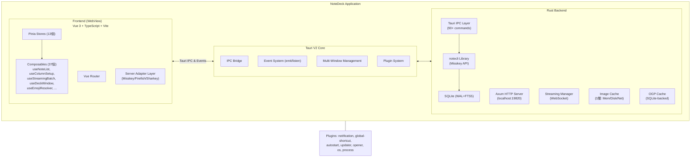
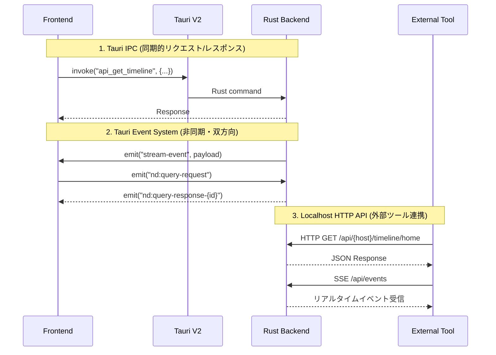
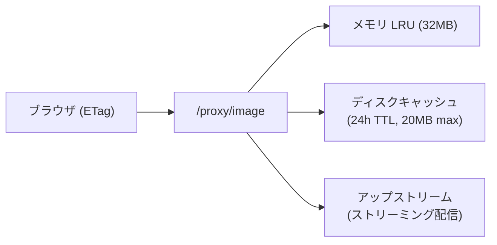
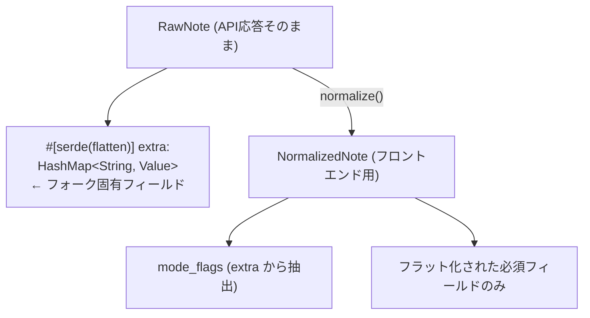
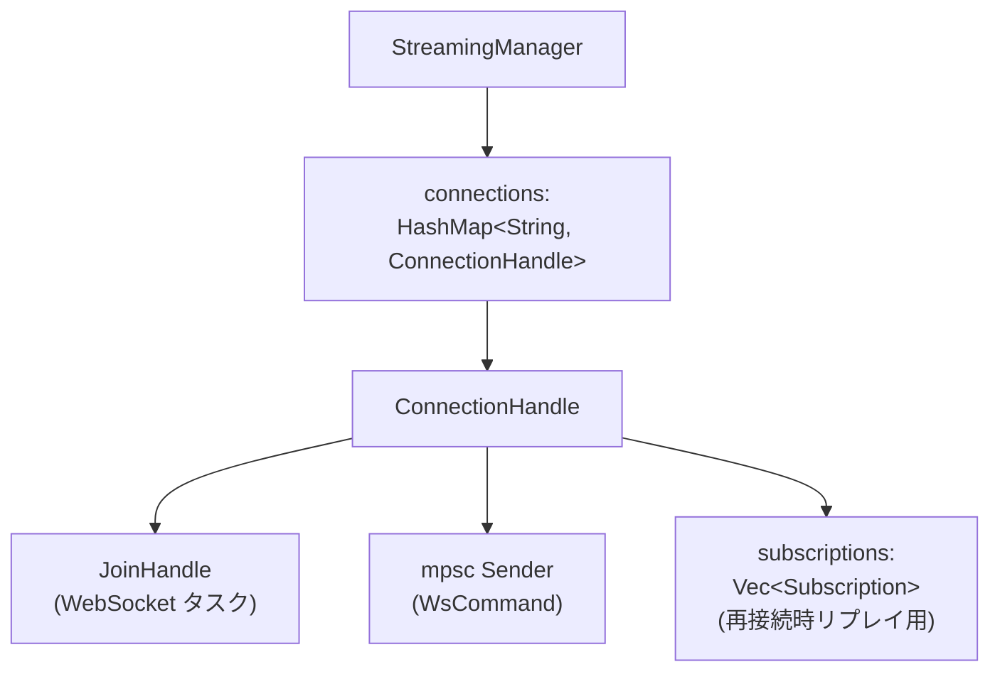
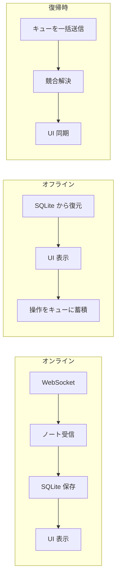
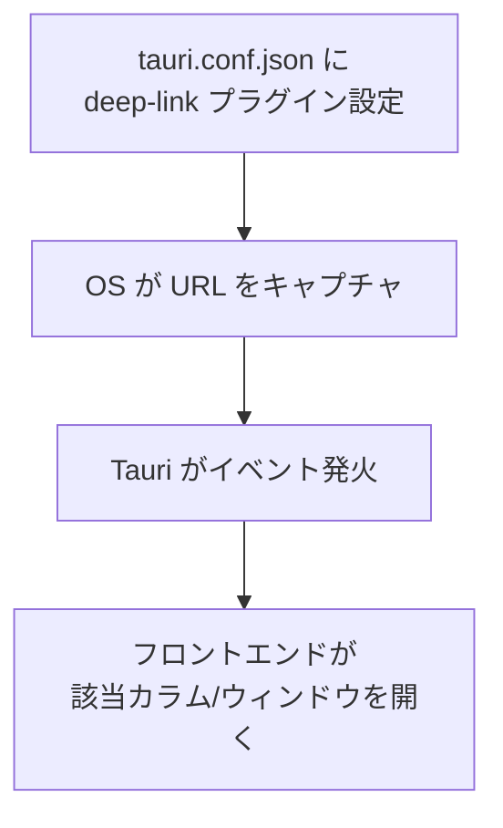

# ARCHITECTURE

NoteDeck — マルチサーバー対応 Misskey デッキクライアントのアーキテクチャ分析。
既存構成の解説、不十分な構成の指摘、および導入候補の新規アーキテクチャを整理する。

---

## 目次

- [第1部: 既存アーキテクチャ](#第1部-既存アーキテクチャ)
  - [全体像](#全体像)
  - [notedeck（GUI アプリ）](#notedeckgui-アプリ)
  - [notecli（コアライブラリ）](#notecliコアライブラリ)
- [第2部: 不十分な構成の指摘](#第2部-不十分な構成の指摘)
  - [アーキテクチャ上の課題](#アーキテクチャ上の課題)
  - [部分採用で完成していない機能](#部分採用で完成していない機能)
- [第3部: 導入候補の新規アーキテクチャ](#第3部-導入候補の新規アーキテクチャ)
- [採用状況マトリクス](#採用状況マトリクス)

---

## 第1部: 既存アーキテクチャ

### 全体像



**技術スタック:**
- **フレームワーク**: Tauri V2
- **フロントエンド**: Vue 3 + TypeScript + Vite
- **バックエンド**: Rust (Axum, notecli)
- **対応プラットフォーム**: Windows, macOS, Linux, Android (開発中)

**Frontend ↔ Backend の3つの通信パターン:**



---

### notedeck（GUI アプリ）

#### A-1. Query Bridge（Rust ↔ フロントエンド双方向クエリ）

**場所**: `query_bridge.rs` + `utils/apiBridge.ts`

```rust
pub async fn query_frontend(app: &AppHandle, query_type: &str, params: Value) -> Result<Value, String> {
    let id = uuid::Uuid::new_v4().to_string();
    let (tx, rx) = tokio::sync::oneshot::channel::<Value>();
    app.emit("nd:query-request", json!({ "id": id, "type": query_type, "params": params }))?;
    tokio::time::timeout(Duration::from_secs(5), rx).await??
}
```

外部 HTTP リクエスト → Rust → Tauri Event → Vue/Pinia → Tauri Event → Rust → HTTP レスポンス。
フロントエンドのリアクティブ状態（デッキカラム、コマンド一覧等）を外部ツールから直接取得可能。

**UX効果**: curl や AI エージェントから NoteDeck の内部状態を操作・取得可能。

---

#### A-2. マルチウィンドウ・デッキ（クロスウィンドウ D&D）

**場所**: `useDeckWindow.ts` + `useColumnDrag.ts`

```typescript
const win = new WebviewWindow(windowId, {
  url: `/?profile=${profileId}&window=${windowId}`,
  width: 500, height: 700,
  decorations: false,
});
```

- カラムを別ウィンドウにポップアウト
- ウィンドウ間でカラムをドラッグ移動（`deck:drag-start` / `deck:move-column` イベント）
- マルチモニター対応のレイアウト保存・復元（モニター切断時の自動再配置）
- ウィンドウ閉鎖時の自動カラム回収

**UX効果**: マルチモニターでの本格的なデッキ運用。

---

#### A-3. 二重 API（IPC + localhost HTTP）

**場所**: `commands.rs`（90+コマンド）+ `http_server.rs`（39ルート + OpenAPI）

同一ロジックを Tauri IPC（アプリ内・高速・型安全）と Axum HTTP（外部向け・Bearer認証・OpenAPI仕様書付き）の2つのインターフェースで公開。SSE イベントストリーム、Scalar UI ドキュメント付き。

**UX効果**: 外部スクリプト・AIエージェント・CLIツールとの連携。

---

#### A-4. ストリーミング → マルチ配信ブリッジ

**場所**: `streaming.rs` + `EventBus`

WebSocket 受信 → 1箇所で3つの出力先に同時配信:
1. OS ネイティブ通知（`tauri-plugin-notification`）
2. WebView イベント（`app.emit("stream-event")`）
3. SSE（外部 HTTP クライアント向け）

```rust
impl FrontendEmitter for TauriEmitter {
    fn emit(&self, event: &str, payload: Value) {
        if event == "stream-notification" {
            self.send_native_notification(&payload);  // OS通知
        }
        self.app.emit("stream-event", wrapped)?;       // WebView通知
    }
}
```

**UX効果**: アプリを開いていなくてもリアクション・リプライを見逃さない。

---

#### A-5. 3層画像プロキシキャッシュ

**場所**: `image_cache.rs` + `/proxy/image`



CSP で外部画像を直接ロードせず、Rust 側のプロキシを経由。ETag/304 対応、インフライト重複排除（watch channel）、同時フェッチ20件制限（semaphore）。

**UX効果**: 画像の瞬間表示。帯域節約。外部サーバー障害時もキャッシュ済み画像を表示。

---

#### A-6. OGP プラグインシステム（15プラットフォーム対応）

**場所**: `ogp/plugins/` (Twitter, YouTube, Pixiv, Amazon, ニコニコ 等)

URL ごとに専用パーサーが起動し、汎用 OG タグ解析より高精度なプレビューを生成。
3段フォールバック: プラグイン → サーバー API → 直接 HTML パース。

**UX効果**: YouTube はサムネ+再生時間、Amazon は価格表示、Twitter は全文表示等リッチなプレビュー。

---

#### A-7. グローバルショートカット + ボスキー + システムトレイ

**場所**: `lib.rs`（デスクトップ専用 `#[cfg(not(mobile))]`）

```rust
// Ctrl+Shift+B: ボスキー（瞬時にウィンドウ非表示）
// Ctrl+Alt+N: クイックノート（ウィンドウ表示 + 投稿フォーム起動）
// トレイアイコン: 左クリックで表示切替、右クリックメニュー
// 閉じるボタン: トレイに隠す（終了しない）
```

条件付きコンパイルによるプラットフォーム分岐:
```rust
#[cfg(not(mobile))]  → updater, global-shortcut, autostart, system tray
#[cfg(target_os = "android")]  → 通知チャンネル設定
```

**UX効果**: 常駐型の SNS クライアントとして自然な操作感。

---

#### A-8. フロントエンド層

**Pinia Stores (13個):**

| Store | 役割 |
|-------|------|
| `accounts` | マルチアカウント管理 |
| `deck` | デッキ・カラム・レイアウト・プロファイル管理（40+カラム種別） |
| `streaming` | WebSocket接続状態・購読管理 |
| `notes` | ノートのキャッシュ・正規化 |
| `emojis` | カスタム絵文字管理 |
| `servers` | 接続先サーバー情報 |
| `theme` | テーマ設定 |
| `ui` | UI状態 |
| `keybinds` | キーバインド設定 |
| `windows` | マルチウィンドウ管理 |
| `plugins` | AiScriptプラグイン |
| `pinnedReactions` | ピン留めリアクション |
| `recentEmojis` | 最近使った絵文字 |

**Server Adapter パターン** (`types.ts` → `registry.ts` → `misskey/`):
Misskey 本体および Firefish, Sharkey, Iceshrimp 等のフォークに共通インターフェースで対応。

---

### notecli（コアライブラリ）

notecli は notedeck のコア基盤となる Rust クレートであり、**スタンドアロン CLI** と **ライブラリ** の二重の役割を持つ。

#### B-1. デュアルパーパス・クレート設計

| モード | エントリポイント | FrontendEmitter | HTTP サーバー |
|--------|------------------|-----------------|---------------|
| **CLI** | `main.rs` (clap) | `NoopEmitter` | なし |
| **デーモン** | `main.rs --daemon` | `EventBusEmitter` | Axum (16ルート) |
| **notedeck 組込** | `lib.rs` (ライブラリ) | `TauriEmitter` (notedeck側) | 拡張版 Axum (39ルート) |

同じビジネスロジック（API呼び出し、DB操作、ストリーミング）が CLI・デーモン・GUI のすべてで共有される。

---

#### B-2. FrontendEmitter トレイトパターン

```
trait FrontendEmitter: Send + Sync
    fn emit(&self, event: &str, payload: Value)
```

ストリーミング（WebSocket）からのイベント配信を実行環境ごとに分離する Strategy パターン:
- **CLI**: `NoopEmitter`（何もしない）
- **デーモン**: `EventBusEmitter`（broadcast channel → SSE）
- **Tauri GUI**: `TauriEmitter`（Tauri Event System → Vue）

`StreamingManager` は実行環境を一切知らずにイベントを配信できる。

---

#### B-3. Raw → Normalized モデル変換

Misskey API レスポンスはフォークによってフィールドが異なる問題を2層モデルで解決:



- 既知フィールドは型安全にデシリアライズ
- 未知フィールド（フォーク固有）は `extra` に自動収集
- 新フォーク固有フィールド追加時に **コード変更不要**

セキュリティ: `Account` の `Drop` 実装で `token.zeroize()` を呼び、メモリ残留リスクを最小化。

---

#### B-4. FTS5 トライグラム検索

```sql
CREATE VIRTUAL TABLE notes_fts USING fts5(
    text, cw,
    content=notes_cache, content_rowid=rowid,
    tokenize='trigram'
);
```

- **trigram トークナイザー**: 3文字単位でインデックス構築。CJK（日本語・中国語・韓国語）の部分文字列検索に対応
- **contentless FTS**: 実データへのポインタのみ保持しストレージを節約
- **CW も検索対象**: Content Warning で隠されたテキストも検索可能

DB マイグレーションは `pragma_table_info` によるカラム存在チェック + `ALTER TABLE ADD COLUMN` のインクリメンタル方式。

---

#### B-5. プラットフォーム・キーチェーン抽象化

```rust
fn init_store(account_id: &str) -> Result<Entry, ...> {
    #[cfg(target_os = "android")]  → AndroidNativeCredentialStore
    #[cfg(target_os = "macos")]    → IosKeychain::Authenticated
    #[cfg(target_os = "ios")]      → IosKeychain::Authenticated
    #[cfg(target_os = "windows")]  → WindowsNativeCredentialStore
    #[cfg(target_os = "linux")]    → LinuxKeyutilsPersistentStore
}
```

クレデンシャル解決の優先順位:
1. キーチェーン → 見つかれば使用（DB にトークン残っていれば消去）
2. DB フォールバック → 見つかればキーチェーンへ**遅延移行**を試行
3. どちらもなければ → Auth エラー

「遅延移行」により、キーチェーン機能追加前の既存ユーザーが自然にセキュアな保存方式へ移行する。

---

#### B-6. ストリーミング・マネージャー



**指数バックオフ再接続**: 接続断 → 1秒 → 2秒 → ... → 最大30秒。成功時にバックオフリセット + 全サブスクリプション再送信。

**メッセージ処理**: `spawn_blocking` で SQLite 書き込みを非同期タスクからオフロード。

**WsCommand**: `Subscribe`, `Unsubscribe`, `SubNote`（ノート個別監視）, `UnsubNote`, `Shutdown`。

---

#### B-7. CLI 設計：Unix 哲学の適用

**5つの出力フォーマット:**

| フォーマット | 用途 | パイプ適性 |
|-------------|------|-----------|
| Default | 人間が読む | △ |
| JSON | プログラム処理 | ◎ |
| JSONL | ストリーム処理 | ◎ |
| IDs | パイプライン | ◎ |
| Compact (TSV) | 一覧表示 | ○ |

```bash
# fzf でインタラクティブ選択
notecli tl -f compact | fzf | cut -f1 | xargs notecli note

# jq でフィールド抽出
notecli tl -f json | jq '.[].text'

# ID リストをパイプで操作
notecli tl -f ids | xargs -I{} notecli delete {}
```

アカウント解決: `@user@misskey.io`（完全修飾）, `abc123`（ID）, `user`（部分一致）。

---

#### B-8. エラーハンドリング: safe_message() パターン

```rust
match self {
    Self::Database(e) => {
        eprintln!("[error] Database: {e}");     // 内部詳細はログへ
        "Database operation failed".to_string() // 汎用メッセージをフロントエンドへ
    }
    Self::Api { message, .. } => message.clone(), // 制御下のメッセージはそのまま
}
```

- 内部情報（SQLite クエリ、ネットワークトレース、キーチェーン詳細）はフロントエンドに露出させない
- `Serialize` 実装で `code` + `safe_message` のペアを自動生成 → フロントエンドでのエラーハンドリングが統一的

---

## 第2部: 不十分な構成の指摘

### アーキテクチャ上の課題

#### ~~C-1. HTTP サーバーの二重定義~~ [解決済み]

notedeck は `notecli::http_server::build_core_routes()` でコア API ルーターを再利用し、notedeck 固有のルート（deck, commands, image proxy, OpenAPI docs）のみを `.merge()` で追加する構成に変更済み。

---

#### ~~C-2. DB マイグレーションの限界~~ [解決済み]

refinery を導入し、番号付き SQL マイグレーション (`migrations/V1__*.sql`) でスキーマを管理する方式に移行済み。`refinery_schema_history` テーブルでバージョンを自動追跡。今後のスキーマ変更は SQL ファイル追加のみで対応可能。

---

#### C-3. テストの不在 [重要度: 高]

notecli・notedeck ともにテストコードが見当たらない。`build_router()` のエクスポートはテスト意図があるが未実装。

**問題**: リグレッションを検出できない。API 仕様の破壊的変更に気づけない。

**改善案**: 少なくとも以下をカバーするテストを追加:
- `normalize()` のモデル変換（フォーク間の差異を含む）
- HTTP API のエンドポイント（`build_router()` を活用）
- `StreamingManager` の接続・再接続・サブスクリプション管理

---

#### C-4. エラー型の粒度不足 [重要度: 低]

`Auth(String)` や `WebSocket(String)` は文字列ベースで、パターンマッチによるプログラム的な回復処理が困難。

**改善案**: 認証エラーを `TokenExpired` / `TokenRevoked` / `NoToken` 等に細分化し、`TokenExpired` の場合はトークンリフレッシュを試行する等の自動回復を可能にする。

---

### 部分採用で完成していない機能

#### C-5. カスタム URI スキーム（`notedeck://`）[重要度: 高]

**現状**: `deck.ts` で URI を生成しタイトルバーに表示するのみ。
**不足**: OS レベルのディープリンク登録がない。ブラウザや他アプリから `notedeck://misskey.io/notes/xxx` でノートを直接開けない。

---

#### C-6. Android バックグラウンド通知 [重要度: 中]

**現状**: `NotificationWorker.kt` で15分間隔のポーリングを実装済み。
**不足**: WebSocket ベースのフォアグラウンドサービスによるリアルタイム通知がない（最大15分の遅延）。

---

#### C-7. AiScript プラグインシステム [重要度: 低]

**現状**: Web Worker で LSP 搭載のコードエディタ、プラグイン実行エンジン、UI レンダラーまで実装済み。
**不足**: プラグインマーケットプレイス（共有・インストールの仕組み）がない。

---

## 第3部: 導入候補の新規アーキテクチャ

### D-1. オフラインファースト・アーキテクチャ ★★★

**概要**: SQLite キャッシュを拡張し、オフライン時もタイムライン閲覧・ノート下書き・リアクション予約を可能にする。



**現状との差分**: `api_get_cached_timeline` でキャッシュ読み出しは可能だが、**書き込み操作のキューイング**と**オフライン検出→自動切替**がない。

**UX効果**: 電車の中や Wi-Fi 不安定な場所でもタイムラインを快適に閲覧。下書きを書いておいて接続復帰時に自動投稿。

**実装コスト**: 中。既存の SQLite キャッシュ基盤を拡張する形で実現可能。

---

### D-2. ディープリンク（OS 統合）★★★

**概要**: `notedeck://` スキームを OS に登録し、ブラウザやチャットアプリの Misskey URL をクリックすると NoteDeck で直接開く。



活用例:
- `notedeck://misskey.io/notes/xxxx` → ノート詳細を開く
- `notedeck://misskey.io/user/alice` → ユーザープロフィールを開く
- ブラウザで misskey.io のリンクをクリック → NoteDeck で開く設定

**UX効果**: Web とデスクトップアプリの境界がなくなる。

**実装コスト**: 低。Tauri プラグイン追加 + フロントエンドルーティングで実現可能。

---

## 採用状況マトリクス

| 領域 | 採用済み | 部分採用 | 未採用（候補） |
|------|---------|---------|---------------|
| Rust↔Frontend通信 | A-1 Query Bridge | | |
| マルチウィンドウ | A-2 クロスW D&D | | |
| 外部API公開 | A-3 二重API | | |
| リアルタイム通信 | A-4 マルチ配信 | C-6 Android BG | |
| キャッシュ | A-5 3層画像 / A-6 OGP | | D-1 オフラインファースト |
| OS統合 | A-7 トレイ/ショートカット | C-5 URI スキーム | D-2 ディープリンク |
| プラグイン | | C-7 AiScript | |

**推奨優先順:**

| 順位 | 項目 | 理由 |
|------|------|------|
| ~~1~~ | ~~C-1 HTTP サーバー統合~~ | ~~解決済み~~ |
| ~~2~~ | ~~C-2 DB マイグレーション~~ | ~~解決済み（refinery 導入）~~ |
| 3 | C-3 テスト追加 | リグレッション防止の基盤 |
| 3 | D-2 ディープリンク | 低コストで Web↔アプリ連携を実現 |
| 4 | D-1 オフラインファースト | 既存 SQLite 基盤の拡張で実現可能。モバイル UX を大幅改善 |
