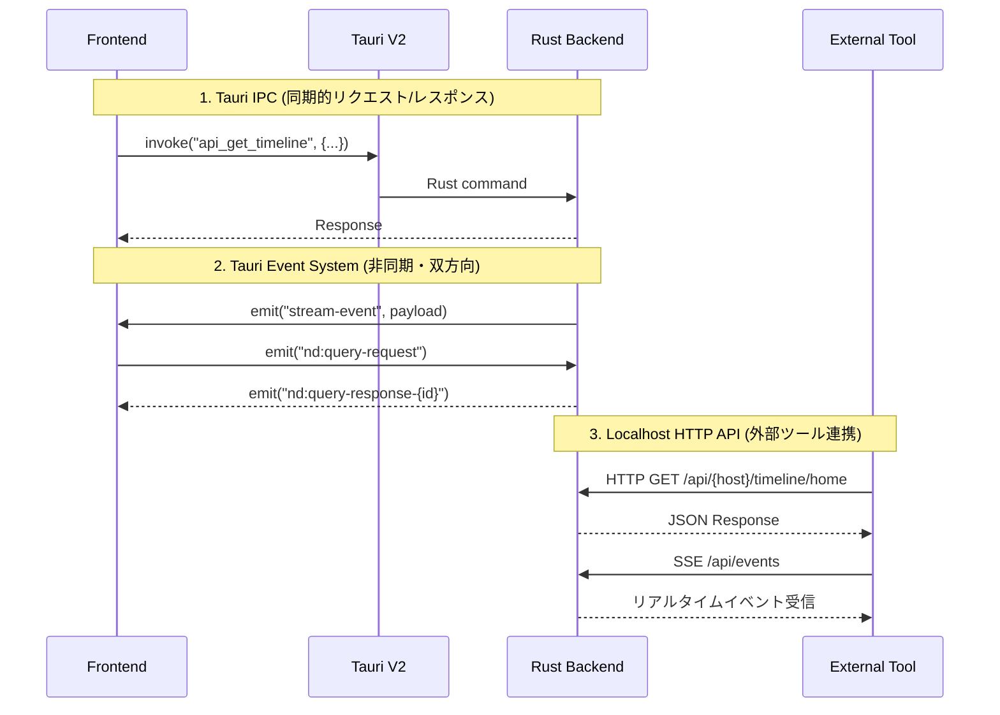
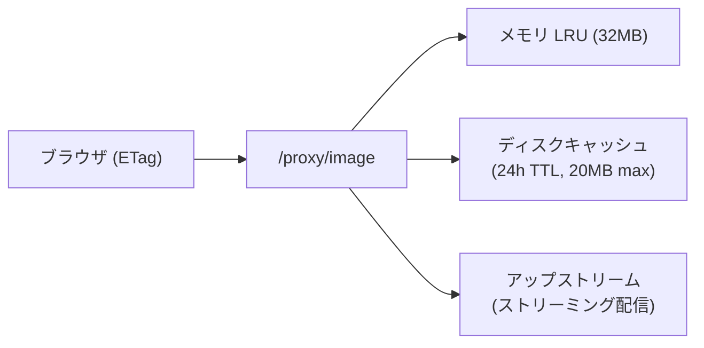
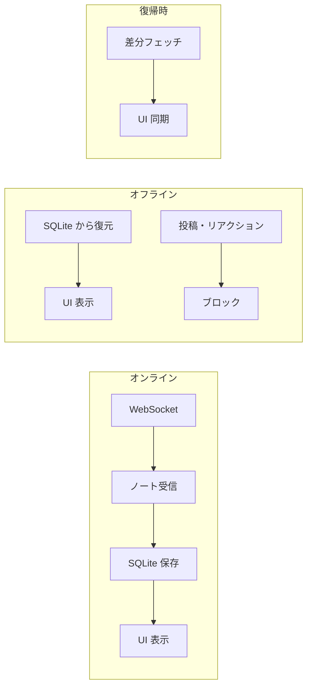

# ARCHITECTURE

NoteDeck — マルチサーバー対応 Misskey デッキクライアントのアーキテクチャ。

---

## 目次

- [第1部: アーキテクチャ概要](#第1部-アーキテクチャ概要)
  - [全体像](#全体像)
  - [notedeck（GUI アプリ）](#notedeckgui-アプリ)
  - [notecli（コアライブラリ）](#notecliコアライブラリ)
- [第2部: 残課題](#第2部-残課題)
- [採用状況マトリクス](#採用状況マトリクス)

---

## 第1部: アーキテクチャ概要

### 全体像


**技術スタック:**
- **フレームワーク**: Tauri V2
- **フロントエンド**: Vue 3 + TypeScript + Vite（Vapor モード移行予定 [#52](https://github.com/hitalin/notedeck/issues/52)）
- **バックエンド**: Rust (Axum, notecli)
- **対応プラットフォーム**: Windows, macOS, Linux, Android (開発中)

**Frontend ↔ Backend の3つの通信パターン:**



---

### notedeck（GUI アプリ）

#### A-1. Query Bridge（Rust ↔ フロントエンド双方向クエリ）

**場所**: `query_bridge.rs` + `utils/apiBridge.ts`

外部 HTTP リクエスト → Rust → Tauri Event → Vue/Pinia → Tauri Event → Rust → HTTP レスポンス。
フロントエンドのリアクティブ状態（デッキカラム、コマンド一覧等）を外部ツールから直接取得可能。

---

#### A-2. マルチウィンドウ・デッキ（クロスウィンドウ D&D）

**場所**: `useDeckWindow.ts` + `useColumnDrag.ts`

- カラムを別ウィンドウにポップアウト
- ウィンドウ間でカラムをドラッグ移動
- マルチモニター対応のレイアウト保存・復元
- ウィンドウ閉鎖時の自動カラム回収

---

#### A-2b. PiP ウィンドウ（常前面フローティングカラム）

**場所**: `usePipWindow.ts` + `PipPage.vue`

- デッキのカラムを常前面フローティングウィンドウとして切り離し
- 375×700px（リサイズ可能）、`alwaysOnTop`、複数同時起動（動的ラベル `pip-*`）
- コマンドパレット / タイトルバー / カラムメニューの 3 経路で起動

---

#### A-3. HTTP API（notecli ルーター共有）

**場所**: `http_server.rs`（notedeck）+ `http_server.rs`（notecli）

notecli の `build_core_routes()` でコア API 16ルートを共有し、notedeck 固有ルート（deck, commands, image proxy, OpenAPI docs）を `.merge()` で追加。SSE イベントストリーム、Scalar UI ドキュメント付き。

---

#### A-4. ストリーミング → マルチ配信ブリッジ

**場所**: `streaming.rs` + `EventBus`

WebSocket 受信 → 1箇所で3つの出力先に同時配信:
1. OS ネイティブ通知（`tauri-plugin-notification`）
2. WebView イベント（`app.emit("stream-event")`）
3. SSE（外部 HTTP クライアント向け）

ストリーミングで受信したノートは `db.cache_note()` で SQLite に非同期保存。

---

#### A-5. 3層画像プロキシキャッシュ

**場所**: `image_cache.rs` + `/proxy/image`



CSP で外部画像を直接ロードせず、Rust 側のプロキシを経由。ETag/304 対応、インフライト重複排除、同時フェッチ20件制限。

---

#### A-6. OGP プラグインシステム（15プラットフォーム対応）

**場所**: `ogp/plugins/` (Twitter, YouTube, Pixiv, Amazon, ニコニコ 等)

URL ごとに専用パーサーが起動し、汎用 OG タグ解析より高精度なプレビューを生成。
3段フォールバック: プラグイン → サーバー API → 直接 HTML パース。

---

#### A-7. グローバルショートカット + ボスキー + システムトレイ

**場所**: `lib.rs`（デスクトップ専用 `#[cfg(not(mobile))]`）

- `Ctrl+Shift+B`: ボスキー（瞬時にウィンドウ非表示）
- `Ctrl+Alt+N`: クイックノート（ウィンドウ表示 + 投稿フォーム起動）
- トレイアイコン: 左クリックで表示切替、右クリックメニュー
- 閉じるボタン: トレイに隠す（終了しない）

---

#### A-8. オフラインファースト（読み取り専用）

**場所**: `useNoteColumn.ts` + `useColumnSetup.ts` + `DeckTimelineColumn.vue`



- **オフライン検出**: WebSocket 切断 (`disconnected`/`reconnecting`) + API fetch 失敗の両方で即座に検出
- **キャッシュ自動切替**: API 失敗時にキャッシュ済みノートを表示し続ける。スクロールで古いノートも SQLite から読み込み
- **書き込みガード**: オフライン時はリアクション・リノート・リプライ・引用・削除・編集・ブックマークをサイレントにブロック
- **自動復帰**: WebSocket 再接続成功 or API fetch 成功で `isOffline` が自動解除
- **UI バナー**: 「オフライン — キャッシュを表示中」をカラム上部に表示

**方針**: 書き込みキューイングは行わない。Misskey はリアルタイム性が重要な SNS であり、オフライン時に蓄積した操作を後から送信しても文脈が失われる。

---

#### A-9. フロントエンド層

**Pinia Stores (13個):**

| Store | 役割 |
|-------|------|
| `accounts` | マルチアカウント管理（ゲスト・ログアウト済みアカウント含む） |
| `deck` | デッキ・カラム・レイアウト・プロファイル管理（40+カラム種別） |
| `streaming` | WebSocket接続状態・購読管理 |
| `notes` | ノートのキャッシュ・正規化 |
| `emojis` | カスタム絵文字管理 |
| `servers` | 接続先サーバー情報 |
| `theme` | テーマ設定 |
| `ui` | UI状態 |
| `keybinds` | キーバインド設定 |
| `windows` | マルチウィンドウ管理 |
| `plugins` | AiScriptプラグイン |
| `pinnedReactions` | ピン留めリアクション |
| `recentEmojis` | 最近使った絵文字 |

**Server Adapter パターン** (`types.ts` → `registry.ts` → `misskey/`):
Misskey 本体および Firefish, Sharkey, Iceshrimp 等のフォークに共通インターフェースで対応。

---

#### A-10. タイムライン DOM 管理

**場所**: `useNoteList.ts` + `useStreamingBatch.ts`

タイムラインの DOM ノード数を一定に保つ戦略。仮想スクロールは採用しない。

**上限管理:**

| 定数 | 値 | 場所 |
|------|-----|------|
| `NOTE_LIST_MAX` | 300 | `useNoteList.ts` |

- `useNoteList` の computed setter で全経路（ストリーミング・手動ロード・ページネーション・onResume）を一括トリム
- `useStreamingBatch` は RAF バッファリング + pending 2段階で高頻度更新を1フレームにまとめる
- 超過分は末尾から削除。削除されたノートは SQLite に保存済みのため再取得可能

**仮想スクロール不採用の理由:**

1. **可変高さ**: テキストのみ(60px)〜画像4枚(500px)〜CW展開で動的変化。高さ推定が破綻しスクロール位置がガタつく
2. **先頭挿入**: ストリーミングで新着が先頭に追加されると全インデックスがずれ、スクロール位置がジャンプする
3. **アニメーション**: `<TransitionGroup>` によるノート出現・退出アニメーションと競合し DOM 追加/削除で途中アニメーションが消える
4. **デスクトップアプリ**: Tauri アプリは Web ブラウザよりメモリに余裕があり、300件の DOM は問題にならない

**固定高さリストへの適用余地:**
通知一覧・ユーザー検索結果・フォロー一覧など、高さ均一でアニメーション不要なリストには将来的に仮想スクロールを検討可能。現時点では件数が爆発しにくいため優先度低。

---

### notecli（コアライブラリ）

notecli は notedeck のコア基盤となる Rust クレートであり、**スタンドアロン CLI** と **ライブラリ** の二重の役割を持つ。

#### B-1. デュアルパーパス・クレート設計

| モード | エントリポイント | FrontendEmitter | HTTP サーバー |
|--------|------------------|-----------------|---------------|
| **CLI** | `main.rs` (clap) | `NoopEmitter` | なし |
| **デーモン** | `main.rs --daemon` | `EventBusEmitter` | Axum (16ルート) |
| **notedeck 組込** | `lib.rs` (ライブラリ) | `TauriEmitter` (notedeck側) | 拡張版 Axum (notecli の `build_core_routes()` + notedeck 固有ルート) |

同じビジネスロジック（API呼び出し、DB操作、ストリーミング）が CLI・デーモン・GUI のすべてで共有される。

---

#### B-2. FrontendEmitter トレイトパターン

ストリーミング（WebSocket）からのイベント配信を実行環境ごとに分離する Strategy パターン:
- **CLI**: `NoopEmitter`（何もしない）
- **デーモン**: `EventBusEmitter`（broadcast channel → SSE）
- **Tauri GUI**: `TauriEmitter`（Tauri Event System → Vue）

---

#### B-3. Raw → Normalized モデル変換

Misskey API レスポンスはフォークによってフィールドが異なる問題を2層モデルで解決:

- 既知フィールドは型安全にデシリアライズ
- 未知フィールド（フォーク固有）は `extra: HashMap<String, Value>` に自動収集
- `normalize()` で統一的な `NormalizedNote` に変換
- 新フォーク固有フィールド追加時に **コード変更不要**

セキュリティ: `Account` の `Drop` 実装で `token.zeroize()` を呼び、メモリ残留リスクを最小化。

---

#### B-4. SQLite + FTS5 + refinery マイグレーション

**DB マイグレーション**: refinery による番号付き SQL マイグレーション (`migrations/V1__*.sql`)。`refinery_schema_history` テーブルでバージョンを自動追跡。今後のスキーマ変更は SQL ファイル追加のみで対応可能。

**FTS5 トライグラム検索**:
```sql
CREATE VIRTUAL TABLE notes_fts USING fts5(
    text, content=notes_cache, content_rowid=rowid, tokenize='trigram'
);
```
CJK（日本語・中国語・韓国語）の部分文字列検索に対応。CW も検索対象。

---

#### B-5. プラットフォーム・キーチェーン抽象化

条件付きコンパイルで各 OS ネイティブのキーチェーンに対応:
- Android → `AndroidNativeCredentialStore`
- macOS/iOS → `IosKeychain::Authenticated`
- Windows → `WindowsNativeCredentialStore`
- Linux → `LinuxKeyutilsPersistentStore`

クレデンシャル解決: キーチェーン → DB フォールバック → 遅延移行（既存ユーザーの自動移行）。

**ゲスト・ログアウト対応**: `get_credentials_or_anon()` でトークンがなければ `(host, "")` を返し、notecli が公開 API にフォールバック。認証必須 API は従来の `get_credentials()` を使用。

---

#### B-6. ストリーミング・マネージャー

- **指数バックオフ再接続**: 接続断 → 1秒 → 2秒 → ... → 最大30秒。成功時にバックオフリセット + 全サブスクリプション再送信
- **メッセージ処理**: `spawn_blocking` で SQLite 書き込みを非同期タスクからオフロード
- **ノート自動キャッシュ**: ストリーミング受信ノートを SQLite に非同期保存（オフラインファースト基盤）

---

#### B-7. CLI 設計：Unix 哲学の適用

5つの出力フォーマット（Default, JSON, JSONL, IDs, Compact/TSV）でパイプライン処理に対応。

```bash
notecli tl -f compact | fzf | cut -f1 | xargs notecli note
notecli tl -f json | jq '.[].text'
```

---

#### B-8. エラーハンドリング: safe_message() パターン

内部情報（SQLite クエリ、ネットワークトレース、キーチェーン詳細）はフロントエンドに露出させない。`Serialize` 実装で `code` + `safe_message` のペアを自動生成。

---

### Vue Vapor モード移行（[#52](https://github.com/hitalin/notedeck/issues/52)）

Vue 3.6 で導入予定の Vapor モード（仮想DOMレス）への移行を計画中。
全96コンポーネントが **100% 互換**（確認済み）。Vue 3.6 安定版リリース後、即座に移行可能。

**移行時にテストが必要な箇所:**

| 項目 | 件数 | 備考 |
|---|---|---|
| `<Teleport>` | 41 | モーダル重ね合わせの動作確認 |
| `<Transition>` / `<TransitionGroup>` | 27 | アニメーション挙動の検証 |

---

## 第2部: 残課題

### テスト

notecli に DB テスト 18件、notedeck に 79件のユニットテストを追加済み。

**未カバー**: `normalize()` モデル変換、HTTP API 統合テスト、`StreamingManager` 接続管理

---

### エラー型の粒度不足 [重要度: 低]

`Auth(String)` や `WebSocket(String)` は文字列ベースで、パターンマッチによるプログラム的な回復処理が困難。認証エラーを `TokenExpired` / `TokenRevoked` / `NoToken` 等に細分化し、自動回復を可能にする余地がある。

---

### 部分採用で完成していない機能

#### カスタム URI スキーム（`notedeck://`）

`deck.ts` で URI を生成しタイトルバーに表示するのみ。OS レベルのディープリンク登録はなし。非公式クライアントとして Misskey URL を横取りするのは不自然なため、外部ツール連携用途に限定して検討。

#### Android バックグラウンド通知 [重要度: 中]

`NotificationWorker.kt` で15分間隔のポーリングを実装済み。WebSocket ベースのフォアグラウンドサービスによるリアルタイム通知は未実装（最大15分の遅延）。

#### AiScript プラグインシステム [重要度: 低]

Web Worker で LSP 搭載のコードエディタ、プラグイン実行エンジン、UI レンダラーまで実装済み。プラグインマーケットプレイス（共有・インストールの仕組み）がない。

---

## 採用状況マトリクス

| 領域 | 採用済み |
|------|---------|
| Rust↔Frontend通信 | A-1 Query Bridge |
| マルチウィンドウ | A-2 クロスウィンドウ D&D |
| PiP ウィンドウ | A-2b 常前面フローティングカラム |
| 外部API公開 | A-3 HTTP API（notecli ルーター共有） |
| リアルタイム通信 | A-4 マルチ配信ブリッジ |
| キャッシュ | A-5 3層画像 / A-6 OGP / A-8 オフラインファースト |
| DOM管理 | A-10 上限付き積み上げ（300件/カラム） |
| OS統合 | A-7 トレイ/ショートカット |
| DB管理 | B-4 refinery マイグレーション |
| テスト | notecli 18件 + notedeck 73件（対応中） |
