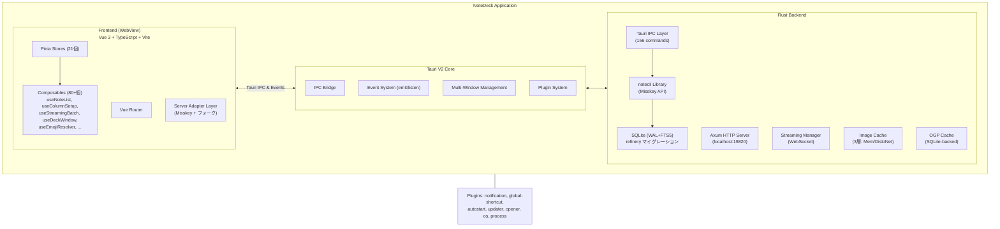
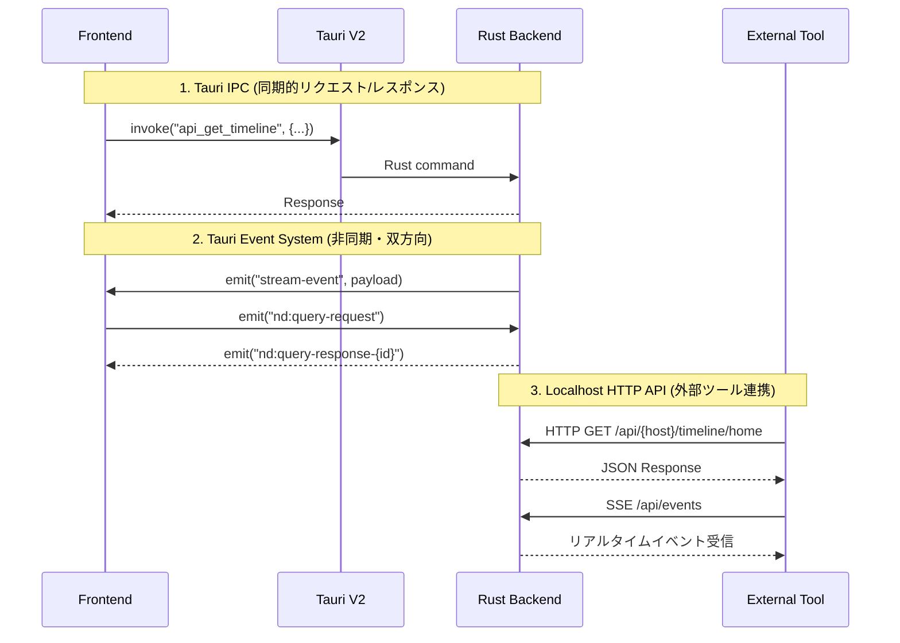
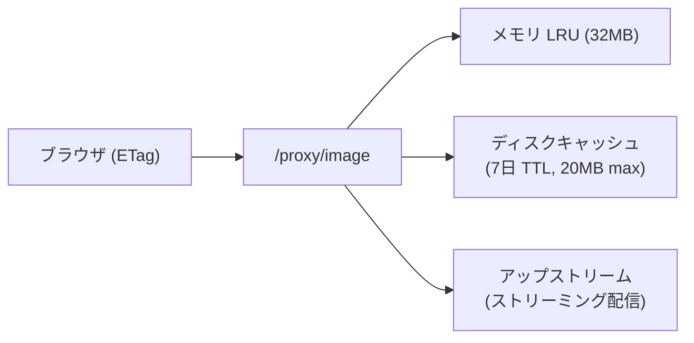
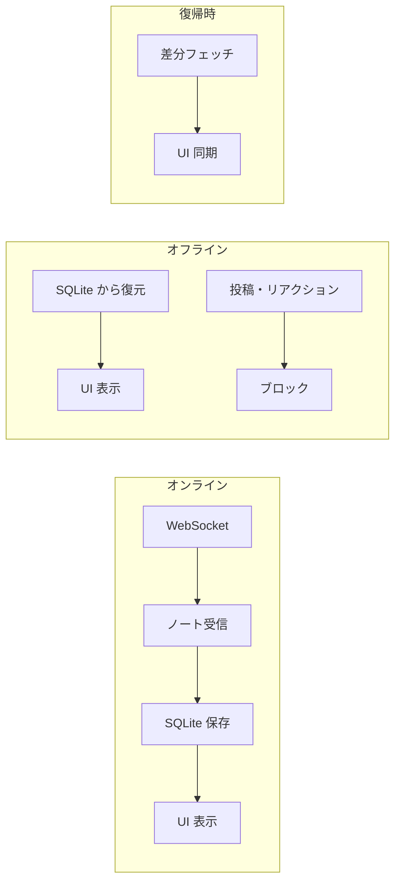
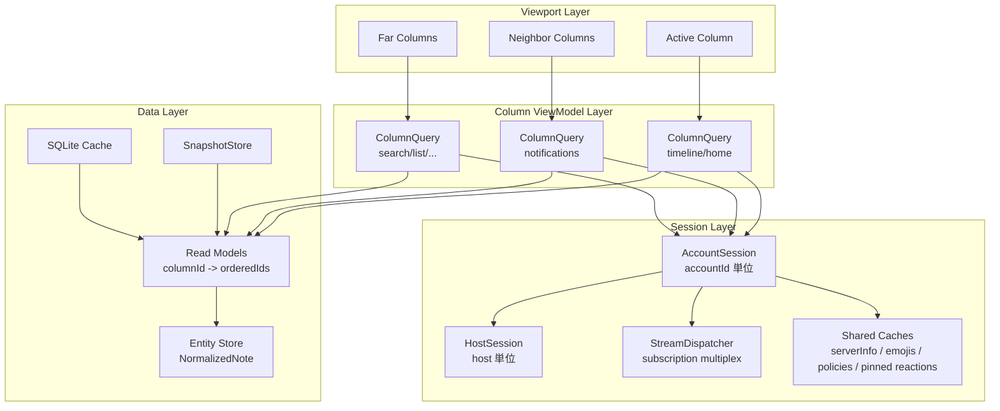
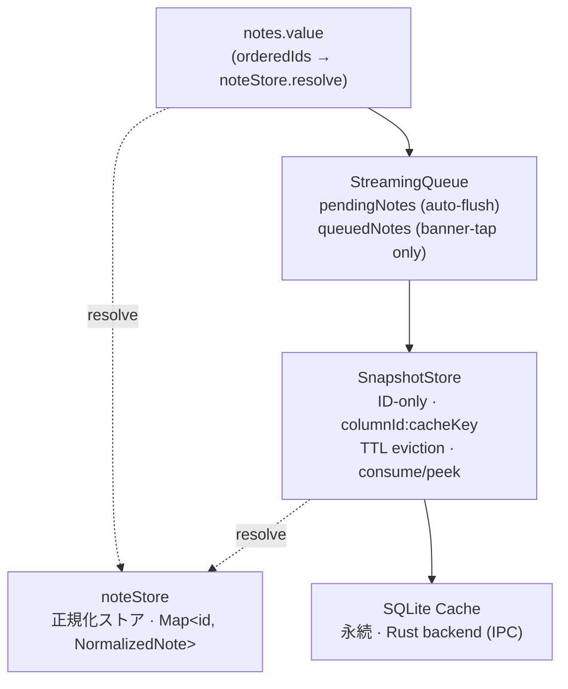

# ARCHITECTURE

NoteDeck — マルチサーバー対応 Misskey デッキクライアントのアーキテクチャ。

---

## 目次

- [アーキテクチャ概要](#アーキテクチャ概要)
  - [全体像](#全体像)
  - [notedeck（GUI アプリ）](#notedeckgui-アプリ)
  - [notecli（コアライブラリ）](#notecliコアライブラリ)
- [Session-centric + Viewport-centric Architecture](#session-centric--viewport-centric-architecture)
- [ノートキャッシュ・キューアーキテクチャ](#ノートキャッシュキューアーキテクチャ)
- [レンダリングパフォーマンス](#レンダリングパフォーマンス)
- [採用状況マトリクス](#採用状況マトリクス)

---

## アーキテクチャ概要

### 全体像



**技術スタック:**
- **フレームワーク**: Tauri V2
- **フロントエンド**: Vue 3 + TypeScript + Vite（Vapor モード移行予定 [#52](https://github.com/hitalin/notedeck/issues/52)）
- **バックエンド**: Rust (Axum, notecli)
- **対応プラットフォーム**: Windows, macOS, Linux, Android (開発中)

**Frontend ↔ Backend の3つの通信パターン:**



---

### notedeck（GUI アプリ）

#### A-1. Query Bridge（Rust ↔ フロントエンド双方向クエリ）

**場所**: `query_bridge.rs` + `utils/apiBridge.ts`

外部 HTTP リクエスト → Rust → Tauri Event → Vue/Pinia → Tauri Event → Rust → HTTP レスポンス。
フロントエンドのリアクティブ状態（デッキカラム、コマンド一覧等）を外部ツールから直接取得可能。

---

#### A-2. マルチウィンドウ・デッキ（クロスウィンドウ D&D）

**場所**: `useDeckWindow.ts` + `useColumnDrag.ts`

- カラムを別ウィンドウにポップアウト
- ウィンドウ間でカラムをドラッグ移動
- マルチモニター対応のレイアウト保存・復元
- ウィンドウ閉鎖時の自動カラム回収

---

#### A-2b. PiP ウィンドウ（常前面フローティングカラム）

**場所**: `usePipWindow.ts` + `src/views/PipPage.vue`

- デッキのカラムを常前面フローティングウィンドウとして切り離し
- 375×700px（リサイズ可能）、`alwaysOnTop`、複数同時起動（動的ラベル `pip-*`）
- コマンドパレット / タイトルバー / カラムメニューの 3 経路で起動

---

#### A-3. HTTP API（notecli ルーター共有）

**場所**: `http_server.rs`（notedeck）+ `http_server.rs`（notecli）

notecli の `build_core_routes()` でコア API 16ルートを共有し、notedeck 固有ルート（deck, commands, image proxy, OpenAPI docs）を `.merge()` で追加。SSE イベントストリーム、Scalar UI ドキュメント付き。

---

#### A-4. ストリーミング → マルチ配信ブリッジ

**場所**: `streaming.rs` + `EventBus`

WebSocket 受信 → 1箇所で3つの出力先に同時配信:
1. OS ネイティブ通知（`tauri-plugin-notification`）
2. WebView イベント（`app.emit("stream-event")`）
3. SSE（外部 HTTP クライアント向け）

ストリーミングで受信したノートは `db.cache_note()` で SQLite に非同期保存。

---

#### A-5. 3層画像プロキシキャッシュ

**場所**: `image_cache.rs` + `/proxy/image`



CSP で外部画像を直接ロードせず、Rust 側のプロキシを経由。ETag/304 対応、インフライト重複排除、同時フェッチ30件制限。

---

#### A-6. OGP プラグインシステム（15プラットフォーム対応）

**場所**: `ogp/plugins/` (Twitter, YouTube, Pixiv, Amazon, ニコニコ 等)

URL ごとに専用パーサーが起動し、汎用 OG タグ解析より高精度なプレビューを生成。
3段フォールバック: プラグイン → サーバー API → 直接 HTML パース。

---

#### A-7. グローバルショートカット + ボスキー + システムトレイ

**場所**: `lib.rs`（デスクトップ専用 `#[cfg(not(mobile))]`）

- `Ctrl+Shift+B`: ボスキー（瞬時にウィンドウ非表示）
- `Ctrl+Alt+N`: クイックノート（ウィンドウ表示 + 投稿フォーム起動）
- トレイアイコン: 左クリックで表示切替、右クリックメニュー
- 閉じるボタン: トレイに隠す（終了しない）

---

#### A-8. オフラインファースト（読み取り専用）

**場所**: `useNoteColumn.ts` + `useColumnSetup.ts` + `DeckTimelineColumn.vue`



- **オフライン検出**: WebSocket 切断 (`disconnected`/`reconnecting`) + API fetch 失敗の両方で即座に検出
- **キャッシュ自動切替**: API 失敗時にキャッシュ済みノートを表示し続ける。スクロールで古いノートも SQLite から読み込み
- **書き込みガード**: オフライン時はリアクション・リノート・リプライ・引用・削除・編集・ブックマークをサイレントにブロック
- **自動復帰**: WebSocket 再接続成功 or API fetch 成功で `isOffline` が自動解除
- **UI バナー**: 「オフライン — キャッシュを表示中」をカラム上部に表示

**方針**: 書き込みキューイングは行わない。Misskey はリアルタイム性が重要な SNS であり、オフライン時に蓄積した操作を後から送信しても文脈が失われる。

---

#### A-9. フロントエンド層

**Pinia Stores (21個):**

| Store | 役割 |
|-------|------|
| `accounts` | マルチアカウント管理（ゲスト・ログアウト済みアカウント含む） |
| `deck` | デッキ・カラム・レイアウト・プロファイル管理（31カラム種別） |
| `streaming` | WebSocket接続状態・購読管理 |
| `notes` | ノートのキャッシュ・正規化 |
| `emojis` | カスタム絵文字管理 |
| `servers` | 接続先サーバー情報 |
| `theme` | テーマ設定 |
| `ui` | UI状態 |
| `keybinds` | キーバインド設定 |
| `windows` | マルチウィンドウ管理 |
| `plugins` | AiScriptプラグイン |
| `pinnedReactions` | ピン留めリアクション |
| `recentEmojis` | 最近使った絵文字 |
| `confirm` | 確認ダイアログ管理 |
| `deckProfile` | デッキプロファイル管理 |
| `deckWallpaper` | デッキ壁紙設定 |
| `performance` | パフォーマンス設定 |
| `themeFileSync` | テーマファイル同期 |
| `toast` | トースト通知 |
| `offlineMode` | オフラインモード状態管理 |
| `realtimeMode` | リアルタイムモード状態管理 |

**Server Adapter パターン** (`types.ts` → `registry.ts` → `misskey/`):
Misskey 本家および Misskey を名乗り続けるフォークに共通インターフェースで対応。

---

#### A-10. タイムライン DOM 管理

**場所**: `NoteScroller.vue` + `useNoteList.ts` + `useStreamingBatch.ts`

`@tanstack/vue-virtual` による仮想スクロールで、viewport + overscan 分のみ DOM に描画する。

**仮想スクロール:**

| 設定 | 値 | 説明 |
|------|-----|------|
| `noteListMax` | 200（デフォルト） | データ配列の上限（`performanceStore` で設定可能、50〜1000） |
| `overscan` | 8 | viewport 外に余分に描画する件数 |
| `estimateSize` | 動的 | 実測値の移動平均（20件ごとに更新） |

- `NoteScroller.vue` が `useVirtualizer` で仮想化。実 DOM は 30-50 件程度に抑制
- `measureElement` + ResizeObserver で可変高さ（テキストのみ 80px〜画像付き 400px+）を自動追跡
- `near-end` イベントで末尾到達を検知し loadMore を発火
- `scrollToIndex` expose でキーボードナビゲーション（j/k）に対応

**アニメーション:**

`<TransitionGroup>` は使わず、データレイヤーでの ID マーキング + CSS `@keyframes` で新着ノートの slide-in アニメーションを実現。位置指定に `translate` プロパティ、アニメーションに `transform` プロパティを使い、独立プロパティとして干渉なく動作する。Vue Vapor Mode 互換。

**バッファリング:**

- `useStreamingBatch` は RAF バッファリング + pending 2段階で高頻度更新を1フレームにまとめる
- 超過分は末尾から削除。削除されたノートは SQLite に保存済みのため再取得可能

---

### notecli（コアライブラリ）

notecli は notedeck のコア基盤となる Rust クレートであり、**スタンドアロン CLI** と **ライブラリ** の二重の役割を持つ。

#### B-1. デュアルパーパス・クレート設計

| モード | エントリポイント | FrontendEmitter | HTTP サーバー |
|--------|------------------|-----------------|---------------|
| **CLI** | `main.rs` (clap) | `NoopEmitter` | なし |
| **デーモン** | `main.rs --daemon` | `EventBusEmitter` | Axum (16ルート) |
| **notedeck 組込** | `lib.rs` (ライブラリ) | `TauriEmitter` (notedeck側) | 拡張版 Axum (notecli の `build_core_routes()` + notedeck 固有ルート) |

同じビジネスロジック（API呼び出し、DB操作、ストリーミング）が CLI・デーモン・GUI のすべてで共有される。

---

#### B-2. FrontendEmitter トレイトパターン

ストリーミング（WebSocket）からのイベント配信を実行環境ごとに分離する Strategy パターン:
- **CLI**: `NoopEmitter`（何もしない）
- **デーモン**: `EventBusEmitter`（broadcast channel → SSE）
- **Tauri GUI**: `TauriEmitter`（Tauri Event System → Vue）

---

#### B-3. Raw → Normalized モデル変換

Misskey API レスポンスはフォークによってフィールドが異なる問題を2層モデルで解決:

- 既知フィールドは型安全にデシリアライズ
- 未知フィールド（フォーク固有）は `extra: HashMap<String, Value>` に自動収集
- `normalize()` で統一的な `NormalizedNote` に変換
- 新フォーク固有フィールド追加時に **コード変更不要**

セキュリティ: `Account` の `Drop` 実装で `token.zeroize()` を呼び、メモリ残留リスクを最小化。

---

#### B-4. SQLite + FTS5 + refinery マイグレーション

**DB マイグレーション**: refinery による番号付き SQL マイグレーション (`migrations/V1__*.sql`)。`refinery_schema_history` テーブルでバージョンを自動追跡。今後のスキーマ変更は SQL ファイル追加のみで対応可能。

**FTS5 トライグラム検索**:
```sql
CREATE VIRTUAL TABLE notes_fts USING fts5(
    text, content=notes_cache, content_rowid=rowid, tokenize='trigram'
);
```
CJK（日本語・中国語・韓国語）の部分文字列検索に対応。CW も検索対象。

---

#### B-5. プラットフォーム・キーチェーン抽象化

条件付きコンパイルで各 OS ネイティブのキーチェーンに対応:
- Android → `AndroidNativeCredentialStore`
- macOS/iOS → `IosKeychain::Authenticated`
- Windows → `WindowsNativeCredentialStore`
- Linux → `LinuxKeyutilsPersistentStore`

クレデンシャル解決: キーチェーン → DB フォールバック → 遅延移行（既存ユーザーの自動移行）。

**ゲスト・ログアウト対応**: `get_credentials_or_anon()` でトークンがなければ `(host, "")` を返し、notecli が公開 API にフォールバック。認証必須 API は従来の `get_credentials()` を使用。

---

#### B-6. ストリーミング・マネージャー

- **指数バックオフ再接続**: 接続断 → 1秒 → 2秒 → ... → 最大30秒。成功時にバックオフリセット + 全サブスクリプション再送信
- **メッセージ処理**: `spawn_blocking` で SQLite 書き込みを非同期タスクからオフロード
- **ノート自動キャッシュ**: ストリーミング受信ノートを SQLite に非同期保存（オフラインファースト基盤）

---

#### B-7. CLI 設計：Unix 哲学の適用

5つの出力フォーマット（Default, JSON, JSONL, IDs, Compact/TSV）でパイプライン処理に対応。

```bash
notecli tl -f compact | fzf | cut -f1 | xargs notecli note
notecli tl -f json | jq '.[].text'
```

---

#### B-8. エラーハンドリング: safe_message() パターン

内部情報（SQLite クエリ、ネットワークトレース、キーチェーン詳細）はフロントエンドに露出させない。`Serialize` 実装で `code` + `safe_message` のペアを自動生成。

---

### Vue Vapor モード移行（[#52](https://github.com/hitalin/notedeck/issues/52)）

Vue 3.6 で導入予定の Vapor モード（仮想DOMレス）への移行準備が**完了**。
既知の移行ブロッカーはゼロ。Vue 3.6 リリース時にそのまま有効化可能。

**対応済み項目:**

- `<script setup>` 必須 — Options API / `export default {}` / `h()` / JSX の使用なし
- `<Transition>` / `<TransitionGroup>` 完全除去済み（全22箇所を composable + CSS `@keyframes` に移行）
- `<Teleport>` 全箇所除去済み（`usePortal()` composable に移行）
- `getCurrentInstance()` / カスタムディレクティブ / mixins / extends の使用なし
- `<Suspense>` / `<KeepAlive>` の使用なし
- `app.config.errorHandler` → `onErrorCaptured` composable に移行済み
- `__VUE_OPTIONS_API__: false` 設定済み

---

## Session-centric + Viewport-centric Architecture

現行実装は **column-centric architecture** をベースとし、各カラムがそれぞれ adapter 初期化、stream 購読、API fetch、描画状態を持つ。ただし以下の最適化は **既に実装済み**:

- **host 単位の共有**: `serversStore`（serverInfo + in-flight dedup + SWR）、`emojisStore`（emoji + in-flight dedup + backoff）
- **account 単位の共有**: `pinnedReactionsStore`（in-flight dedup）
- **Rust 側の stream dedup**: `stream_connect(accountId)` は idempotent — 物理 WebSocket 接続は account 単位で 1 本
- **Viewport 制御**: `useColumnVisibility`（IntersectionObserver + 遅延 unmount）、`eagerMountRadius`（アクティブ±1 グループのみ eager mount）、非表示カラムの streaming pause + unsubscribe
- **スナップショット復元**: `useSnapshotStore`（ID-only、TTL eviction、再マウント時の即時復元）

**残存する column-centric な課題**:

- **adapter インスタンスの重複**: 各カラムが `createMisskeyAdapter()` で毎回 `new MisskeyApi()` + `new MisskeyStream()` を生成。同一 account で 5 カラムあれば 5 インスタンス
- **JS 側の event listener 重複**: Rust 側の stream dedup にもかかわらず、各 `MisskeyStream` インスタンスが独立して Tauri event listener を登録
- **同時 live 数の上限なし**: マウントされたカラムは全て live（stream subscribe + API fetch）になる。budget 概念がない
- **Hydration 段階なし**: カラムは mounted/unmounted の 2 状態のみ。shell → snapshot → live の段階的表示がない

今後は以下の 2 原則で残存課題を解消する。

1. **Session-centric**: adapter インスタンスを **account 単位で singleton 化** し、JS 側の重複を排除する
2. **Viewport-centric**: 同時 live 数に **budget** を設け、off-screen カラムの shell/snapshot 表示を改善する

目標:

- 同一 account の adapter / MisskeyStream インスタンスを 1 つに集約する
- 同時 live カラム数に上限を設ける（`maxLiveColumns`）
- 初回表示を「枠が出る → キャッシュが出る → live 化」の段階的表示にする

### 設計方針

責務を以下の 3 層に分ける。

| 層 | 単位 | 責務 |
|----|------|------|
| **Session Layer** | `accountId` / `host` | adapter, stream 接続、購読集約、serverInfo / emoji / policy / pinned reactions 共有 |
| **ViewModel Layer** | `columnId` | session 上の query 定義、並び順、snapshot、UI 状態 |
| **Viewport Layer** | 可視範囲 | mount / hydrate / suspend / dispose の制御 |

column は「接続主体」ではなく、**session に対する query client** として扱う。

### 新しい全体像



### Session Layer

#### S-1. HostSession（大部分が実装済み）

**単位**: `host`

**実装済み（既存 Pinia store）**:

- `serversStore.getServerInfo(host)` — serverInfo 取得 + in-flight dedup + SWR revalidation
- `emojisStore.ensureLoaded(host, fetcher)` — emoji 取得 + in-flight dedup + backoff
- server policy / timeline availability の共有

**追加不要**: HostSession を新しいクラス/store として導入する必要はない。既存の `serversStore` + `emojisStore` がこの責務を果たしている。

#### S-2. AccountSession（adapter singleton 化が未実装）

**単位**: `accountId`

**実装済み**:

- `pinnedReactionsStore.ensureLoaded(accountId, fetcher)` — pinned reactions 共有 + in-flight dedup
- Rust 側 `stream_connect(accountId)` — 物理 WebSocket 接続の dedup（account 単位で 1 本）
- `useMultiAccountAdapters` — クロスアカウント機能でのみ adapter cache を実装

**未実装（主要課題）**:

- **adapter の singleton 化**: 通常カラムは毎回 `createMisskeyAdapter()` で `new MisskeyApi()` + `new MisskeyStream()` を生成。`useInitAdapter.ts` に accountId 単位の adapter cache を追加して解消する
- **JS 側の event listener 集約**: 複数の MisskeyStream インスタンスが同じ Tauri event を重複 listen している

**推奨アプローチ**: 既存の `useInitAdapter.ts` に `useMultiAccountAdapters` と同じ in-flight dedup + cache パターンを適用する。新しい AccountSession クラスは不要。

**制約**:

- 同一 `accountId` で `MisskeyApi` / `MisskeyStream` は原則 1 インスタンス
- column が unmount しても adapter cache は即破棄しない
- adapter の寿命は column より長く、account 切替・ログアウト時にのみ破棄する

#### S-3. SharedSubscription

**単位**: `QueryKey`

`QueryKey` は「同じ stream を共有できる query」を表す正規化キー。

例:

- `timeline:accountA:home`
- `timeline:accountA:local`
- `notifications:accountA`
- `channel:accountA:channelId`

**責務**:

- Rust / Tauri 側の subscription を 1 本だけ持つ
- 複数 column observer に配信する
- observer 数が 0 になったとき即 unsubscribe せず、短い grace period を持つ
- 再表示時に `sinceId` 差分 fetch と再購読を行う

### ViewModel Layer

#### V-1. ColumnQuery

column は adapter を直接持たず、以下を宣言するだけにする。

- `queryKey`
- `fetchPolicy`
- `cacheKey`
- `streamMode`
- `filter`
- `sort`
- `hydratePriority`

これにより、`useNoteColumn()` の責務を次の 2 つに分割する。

- **Query 定義**: カラムが何を見たいか
- **Hydration 制御**: いつ live にするか

#### V-2. Read Model — 不採用

~~per-column Read Model（columnId 単位の fine-grained invalidation）~~ は検討の結果 **不採用** とした。

**不採用の理由**:

- Phase 1-2 完了後の計測で `resolve()` は平均 0.10ms、`triggerRef` は 0.00ms — ボトルネックではない
- `maxLiveColumns` が trigger 頻度自体を制限するため、fan-out コストは column 数に比例しない（20 カラム × 0.10ms × 3 回/秒 = 6ms/秒 → CPU 0.6%）
- 共有 noteStore + per-column orderedIds の現行設計は SNS クライアントの要件（同じノートの同じ状態を全カラムが見る）に最適
- Read Model は entity のコピーをカラム数分持つため、メモリ増加 + リアクション等の cross-column 同期を自前で実装する必要がある
- 実装コストに対してリターンが合わない

### Viewport Layer（部分的に実装済み）

**実装済み**:

- `useColumnVisibility`（IntersectionObserver + `columnUnloadDelay` で遅延 unmount）
- `DeckColumnsArea.vue` の `eagerMountRadius`（デスクトップ: アクティブ±1、コンパクト: アクティブのみ）
- `useNoteColumn` の可視性監視（非表示で `streamingBatch.setPaused(true)` + `disposeSubscription()`、再表示で `resubscribe` + `onResume` 差分フェッチ）
- 未マウントカラムの skeleton 表示（`DeckColumnsArea.vue` の `columnShell`）

**Phase 2 で実装済み**:

- `maxLiveColumns` budget（active からの距離順に live カラム数を制限、超過分は suspended）
- shell 段階での snapshot preview 表示（`DeckColumnsArea.vue` の `getShellPreview()`）
- `useNoteColumn` が `isVisible` + `isLive` の 2 軸で streaming を制御

#### P-1. Hydration State Machine（拡張提案）

現行の 2 状態を以下の 6 状態に拡張する。

| 状態 | 意味 | 現行の対応 |
|------|------|-----------|
| `unmounted` | DOM なし | `v-if="false"` / skeleton 表示 |
| `shell` | 枠だけ表示。接続なし | **新規** |
| `snapshot` | Snapshot / SQLite の読み取り結果を表示 | **新規**（mount 後に snapshot restore はある） |
| `warming` | adapter attach 済み、API fetch / diff 取得中 | `connect()` 内部で暗黙的に存在 |
| `live` | stream 購読あり、差分反映中 | `mounted` 状態 |
| `suspended` | DOM はあるが購読停止、snapshot のみ更新 | `useNoteColumn` の非表示時 pause |

状態遷移:

```text
unmounted -> shell -> snapshot -> warming -> live
live -> suspended -> live
snapshot -> unmounted
```

#### P-2. 初期起動ルール

**現行の動作**: `eagerMountRadius` でアクティブ±1 グループのみ mount。mount されたカラムは即座に `connect()` → live 化。

**改善案**: mount と live 化を分離する。

起動直後に live 化するのは以下のみ:

- アクティブカラム
- 左右の近傍カラム（通常 1 本ずつ）
- モバイルでは表示中の 1 カラムのみ

それ以外のカラムは:

- DOM は shell または snapshot（mount はするが connect しない）
- stream 購読は開始しない
- API fetch は即時実行しない

#### P-3. Visibility Budget

viewport layer は同時 live 数に上限を持つ。

例:

- Desktop: `maxLiveColumns = 3`
- Mobile: `maxLiveColumns = 1`
- Low quality mode: `maxLiveColumns = 2`

新しいカラムが live 化されるとき、予算超過なら最も遠い live column を `suspended` に落とす。

### 起動フロー仕様

#### Cold Start

1. `DeckLayout` は全カラムの shell を即描画
2. viewport manager が active / neighbor を判定
3. 各対象カラムは snapshot を同期表示
4. `AccountSession` を attach
5. `HostSession` が `serverInfo`, policy, emojis を並列 warmup
6. `ColumnQuery` が API diff を取得
7. stream 購読を開始して `live` に移行

重要なのは、**step 3 の表示が step 4-7 を待たない**こと。

#### Resume / Foreground 復帰

1. session は生きていれば再利用
2. live column のみ `sinceId` 差分取得
3. suspended column は再可視になるまで差分取得しない
4. offline 復帰時は session 単位で reconnect し、column ごとに個別 reconnect しない

### データ取得ポリシー

#### Fetch Policy

| ポリシー | 用途 |
|----------|------|
| `cache-only` | far column, offline, low-memory |
| `cache-and-network` | 起動直後の active / neighbor |
| `network-live` | active live column |
| `suspendable-live` | desktop の近傍列 |

#### Prefetch Policy

prefetch は chunk だけでなく session も対象にする。

- **UI prefetch**: カラム component chunk
- **Data prefetch**: `HostSession` warmup
- **Live prefetch**: 近傍列のみ stream attach 準備

この 3 つを分離し、`UI chunk を読んだ = API も stream も開始` にならないようにする。

### Rust / IPC の現状

Rust 側は既に session 指向に近い設計になっている。

**実装済み**:

- `stream_connect(accountId)` は idempotent（account 単位で 1 WebSocket）
- `load_cached_timeline` は viewport 表示用の軽量レスポンスを返せる
- `fetch timeline diff` は `sinceId` / `untilId` を cheap に扱える

**Phase 1 で確認が必要**:

- adapter singleton 化に伴い、JS 側から `stream_connect` の呼び出し回数が減ることで Rust 側の挙動に影響がないか確認

### UI 表示仕様

初回体感を安定させるため、カラム UI は 3 段階で出す。

1. **Shell**: ヘッダ、枠、プレースホルダ
2. **Snapshot**: キャッシュ済みノートを即表示
3. **Live Upgrade**: リアクション数、未読、streaming badge、OGP 等を段階的に有効化

初回 1 画面では「完全な live 機能」より「スクロール可能な内容が見えること」を優先する。

### 移行ステップ

#### Phase 1. Adapter Cache 導入 ✅ 完了

`useInitAdapter.ts` に accountId 単位の adapter cache を導入済み。

- `initAdapterFor()` で既存 adapter があればそれを返す（in-flight dedup 付き）
- MisskeyApi / MisskeyStream インスタンス数が account 数に制限された
- adapter の寿命は column unmount で終わらない（`destroyAdapter()` で明示破棄）
- `useColumnSetup.disconnect()` は `stream.cleanup()` を呼ばず、subscription dispose + handler off のみ
- `useMultiAccountAdapters` はグローバル cache に委譲して簡素化済み
- `accounts.removeAccount()` / `logoutAccount()` で `destroyAdapter()` を呼び出し

#### Phase 2. Visibility Budget 導入

既存の `useColumnVisibility` に `maxLiveColumns` budget を追加する。

- `maxLiveColumns`（Desktop: 3、Mobile: 1、Low quality: 2）
- 予算超過時に最も遠い live column を `suspended` に落とす
- ~~active / neighbor 判定~~ → `eagerMountRadius` が既に機能中
- shell 段階での snapshot 表示（`DeckColumnsArea.vue` の skeleton 改善）

**不要な作業**（既に実装済み）:
- ~~active / neighbor 判定~~ → `eagerMountRadius` で実装済み
- ~~off-screen column の pause/unsub~~ → `useNoteColumn` の可視性監視で実装済み

#### ~~Phase 3. Read Model 分離~~ — 不採用

Phase 1-2 完了後の計測で `resolve()` コストが無視できるレベル（0.10ms）であり、`maxLiveColumns` が trigger 頻度を制限するため不要と判断。詳細は V-2 を参照。

#### Phase 3. Lightweight First Paint

- initial note card の軽量化
- heavy interaction popup / detail fetch の遅延化
- OGP / MFM / highlight の段階的 upgrade

### 追加で検討できる高インパクト施策

Phase 1-4 の主計画に加えて、**さらに構造変更で大きく効く余地があるか**を再評価した結果、候補は多くない。

現時点で「劇的改善」の可能性がある追加候補は、以下の 2 つにほぼ絞られる。

#### A-1. JS 側 stream dispatcher の単一化 — ✅ Phase 1 で大部分解消

adapter singleton 化（Phase 1）により、MisskeyStream は accountId 単位で 1 インスタンスになった。`listen('stream-event')` の登録も adapter 単位で 1 つに集約されている。

column は `createSubscription()` で subscription を登録し、handler maps（`noteHandlers`, `notifHandlers` 等）は subscriptionId をキーとして分離管理される。column unmount 時は `subscription.dispose()` で自分の handler のみ解除し、他 column に影響しない。

**残る改善余地**:

- `stream.reconnect()` が複数 column の `deckResumeSignal` watch から重複呼び出しされる（generation guard で安全だが無駄）
- reconnect を adapter cache 側で一括管理すれば、resume 時の無駄な `registerListeners()` 呼び出しを排除できる

**期待効果**: 小（現状で既に実用上の問題なし）

#### A-2. Initial Hydration の batch 化

現行の `useNoteColumn()` は、各 column が個別に cache restore, streaming 準備, API fetch を進める。adapter 初期化は Phase 1 の cache + in-flight dedup で accountId 数に削減済みだが、subscription 登録や API fetch は依然として column ごとに個別実行。

**改善案**:

- Rust / IPC に「visible columns の初期 hydrate をまとめて返す」入口を追加する
- 返却内容は `snapshot IDs`, `latest note metadata`, `diff fetch に必要な cursor` など、first paint に必要な最小集合に絞る
- column ごとの `connect()` は段階的 upgrade に使い、初回表示の責務を batch hydration に寄せる

**期待効果**:

- IPC latency 100-200ms 短縮（複数 subscription 同時登録）
- 実装コスト: **高**（Rust 側に batch command 追加が必要）

**位置づけ**:

- Phase 2 完了後に起動体感がまだ重い場合に検討する
- `maxLiveColumns` と競合しない。むしろ相性が良い

### 今は優先度を上げなくてよい施策

#### N-1. `MkNote` / `MkMfm` の全面軽量化を先にやること

`MkNote` の setup コストや `MkMfm` の同期 parse は確かに重いが、これは「表示中の数十件をどう軽くするか」という話であり、column ごとの接続 fan-out や live attach の構造課題とは別である。

- first paint 安定化には有効
- ただし、起動全体の構造ボトルネックを置いたままでは改善幅が読みづらい

したがって、**Phase 4 の軽量 first paint** として扱うのが妥当である。

### 追加施策を含めた優先順位

| # | 施策 | 状態 | 次のアクション |
|---|------|------|---------------|
| 1 | adapter singleton 化 + stream listener 集約 | ✅ **完了** | — |
| 2 | `maxLiveColumns` + shell / snapshot / live の hydration state machine | ✅ **完了** | — |
| 3 | initial hydration の batch 化 | 未着手 | 起動体感がまだ重い場合に検討 |
| ~~4~~ | ~~Read Model / fine-grained invalidation~~ | **不採用** | 計測の結果、コスト対効果が合わない |
| 4 | lightweight first paint の拡張 | 未着手 | ボトルネックが IPC/API から移った場合のみ |

起動時のボトルネックは Rust IPC + API fetch のレイテンシ（500-1200ms）が支配的であり、MkNote/MkMfm のレンダリングコストではない。Phase 2 の `maxLiveColumns` で同時 live 数を制限すれば、IPC/API の並列度も自然に制御される。

### 採用判断基準

この移行を「成功」とみなす条件:

| 条件 | 対応 Phase | 現行の達成状況 |
|------|-----------|---------------|
| 同一 account の adapter / MisskeyStream が 1 インスタンス | Phase 1 | **達成済み**（adapter cache 導入） |
| カラム数が増えても同時 live 数が一定 | Phase 2 | **達成済み**（`maxLiveColumns` budget） |
| off-screen column が CPU と stream listener をほぼ消費しない | Phase 2 | **達成済み**（pause + unsub + live budget） |
| splash 後に shell または snapshot が見える | Phase 2 | **達成済み**（skeleton + snapshot preview） |

### 現行構成との対応

| 領域 | 現行 | 状態 | 改善後 |
|------|------|------|--------|
| serverInfo 共有 | `serversStore`（in-flight dedup + SWR） | **実装済み** | 変更不要 |
| emoji 共有 | `emojisStore`（in-flight dedup + backoff） | **実装済み** | 変更不要 |
| pinnedReactions 共有 | `pinnedReactionsStore`（in-flight dedup） | **実装済み** | 変更不要 |
| stream 接続 dedup | Rust 側 `stream_connect(accountId)` | **実装済み** | 変更不要 |
| adapter 管理 | `useInitAdapter` の accountId 単位 cache | **実装済み** | adapter singleton + destroyAdapter API |
| 同時 live 数制限 | `useColumnVisibility` の `maxLiveColumns` budget | **実装済み** | active からの距離順に budget 配分 |
| 可視性制御 | `useColumnVisibility` + `eagerMountRadius` + `maxLiveColumns` | **実装済み** | — |
| off-screen pause | `useNoteColumn` で pause + unsubscribe | **実装済み** | 変更不要 |
| snapshot 復元 | `useSnapshotStore`（ID-only, TTL） + shell preview | **実装済み** | — |
| note invalidation | `noteStore`（RAF batch + skipTrigger） | **実装済み** | 変更不要（計測の結果、コスト無視できる） |

---

## ノートキャッシュ・キューアーキテクチャ

ノートデータは **正規化ストア + ID ベースビュー** で管理する。各カラムはノート実体を持たず、ID の順序リストのみを保持する。



### 正規化ストア（noteStore）

全ノートの唯一の実体を保持するグローバル `Map<string, NormalizedNote>`。

- カラムは `orderedIds`（ID 配列）のみを保持し、`noteStore.resolve(ids)` で実体を取得
- ノート更新は `noteStore.put()` で in-place 反映 → 全カラムに自動伝播
- ノート削除は `noteStore.remove()` → `onDelete` リスナーで全カラムの `orderedIds` をクリーンアップ
- `noteStoreMax` 超過時に FIFO eviction（`get()` 時に insertion order を更新し LRU 風に動作）

### Layer 1: SQLite Cache

Rust 側（notecli）で管理する永続キャッシュ。フロントエンドは read + delete のみ。

- `loadCachedTimeline(accountId, tlType)` — キャッシュ読み込み
- `loadCachedTimelineBefore(accountId, tlType, before)` — 過去ノート読み込み
- `purgeStaleCachedNotes(adapter, ids, ...)` — サーバーに存在しないノートを削除

書き込みは Rust 側のストリーミング処理が担当。

### Layer 2: SnapshotStore（ID-only）

カラム再マウントやタブ切り替え時の即時復元用。**ID のみ保存**し、復元時に `noteStore.resolve()` で実体を取得する。

- **キー**: `${columnId}:${cacheKey}` の複合キー
  - `cacheKey` は `config.cache.getKey()` が返す値（カラムタイプに応じた文脈キー）
  - Timeline カラム: `"home"`, `"local"`, `"global"` 等
  - Antenna カラム: `"antenna:${antennaId}"`
  - Channel カラム: `"channel:${channelId}"`
  - Favorites/Mentions 等: `"favorites"`, `"mentions"` （固定）
- **内部値**: `{ noteIds: string[], scrollTop: number, savedAt: number }`
- **復元値**: `{ notes: NormalizedNote[], scrollTop: number }`（resolve 済み）
- **eviction**: TTL ベース（`performanceStore.snapshotTTL`）。save 時に expired を一括削除
- **上限**: `performanceStore.snapshotMaxNotes` で保存 ID 数を制限
- **メモリ効率**: NormalizedNote[] を丸ごと保持する設計と比較して約 100 倍削減

| 操作 | 用途 | 消費 |
|------|------|------|
| `save(colId, cacheKey, notes, scrollTop)` | ID + scrollTop を保存 | — |
| `restore(colId, cacheKey)` | タブ切り替え復元 | **非消費**（何度も復元可能） |
| `restoreAndConsume(colId, cacheKey)` | カラム再マウント復元 | **消費**（1回限り） |
| `evictColumn(colId)` | カラム削除時に全 cacheKey 消去 | — |

### Layer 3: StreamingQueue（useStreamingBatch）

ストリーミングで受信したノートのバッファリングとバナー表示を管理。

| キュー | 用途 | auto-flush |
|--------|------|------------|
| `pendingNotes` | スクロール中に溜まったストリーミングノート | **する**（Misskey 本家準拠: スクロールトップで flush） |
| `queuedNotes` | タブ切り替え差分フェッチ結果 | **しない**（バナータップ / `scrollToTop()` のみ） |

`scrollToTop()` 時に `queuedNotes` → `pendingNotes` にマージしてから `flushPending()` を実行。アニメーション処理を統一する。

### ロードパス共通ヘルパー（useNoteColumn）

4 つのデータロードパス（`connect` / `reconnect` / `switchWithSnapshot` / `onResume`）は以下の共通ヘルパーを使用:

- `fetchAndDedup(adapter, opts)` — dedup 付き API フェッチ
- `verifyStaleNotes(adapter, cachedIds, freshIds)` — キャッシュ整合性検証
- `handleFetchError(e, tryCacheFallback?)` — エラーハンドリング（オフラインフォールバック）
- `mergeUpdate(newNotes)` — 既存ノートを in-place 更新 + 新規ノートを挿入（`useNoteList`）

### キー不変条件

1. **正規化ストアが唯一の実体**: ノートの正規データは `noteStore` にのみ存在。カラム・スナップショットは ID 参照のみ
2. **スナップショットは降順**: noteIds は `createdAt` 降順で保存。復元時に再ソートしない
3. **noteIds 整合性**: `setNotes()` 後、`noteIds` は `notes.value` の ID と完全一致（`useNoteList` の setter が保証）
4. **StreamingQueue 分離**: `pendingNotes` は auto-flush、`queuedNotes` は明示 flush。混同しない
5. **SnapshotStore TTL**: 唯一の eviction 手段。LRU/容量制限は不要（カラム数はデッキレイアウトで制約）
6. **SQLite は読み取り専用**: フロントエンドは read + delete のみ

---

## レンダリングパフォーマンス

3つの基盤で描画パフォーマンスを維持する:

1. **CSS レンダリング規約** — Compositor-only アニメーション（transform, opacity のみ）、Layout Thrashing 回避、CSS Containment
2. **Frame Scheduler** — DOM read/write のフェーズ分離による Layout Thrashing 回避（fastdom と同じ考え方）
3. **Adaptive Quality** — Jank 検出に基づく CSS 描画プロパティ（blur, shadow, animation）の自動調整

仮想スクロールは TanStack vue-virtual（NoteScroller）で対応済み。

詳細は **[DEVELOPMENT.md — レンダリングパフォーマンス](DEVELOPMENT.md#レンダリングパフォーマンス)** を参照。

---

## 採用状況マトリクス

| 領域 | 採用済み |
|------|---------|
| Rust↔Frontend通信 | A-1 Query Bridge |
| マルチウィンドウ | A-2 クロスウィンドウ D&D |
| PiP ウィンドウ | A-2b 常前面フローティングカラム |
| 外部API公開 | A-3 HTTP API（notecli ルーター共有） |
| リアルタイム通信 | A-4 マルチ配信ブリッジ |
| キャッシュ | A-5 3層画像 / A-6 OGP / A-8 オフラインファースト |
| DOM管理 | A-10 上限付き積み上げ（デフォルト200件/カラム、設定で可変） |
| レンダリングパフォーマンス | [DEVELOPMENT.md](DEVELOPMENT.md#レンダリングパフォーマンス) に詳細 |
| OS統合 | A-7 トレイ/ショートカット |
| DB管理 | B-4 refinery マイグレーション |
| テスト | notecli 18件 + notedeck 239件 |
| パフォーマンス改善 | [PERFORMANCE.md](PERFORMANCE.md) に詳細ロードマップ |
