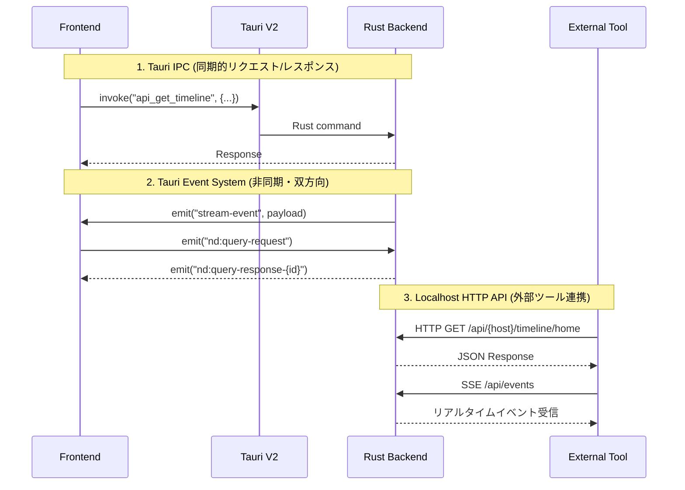
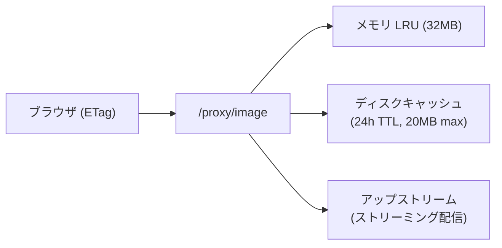
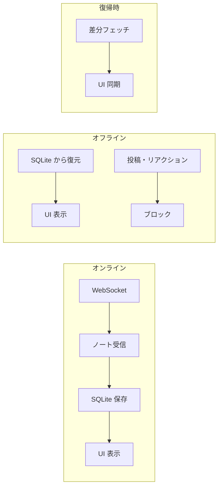
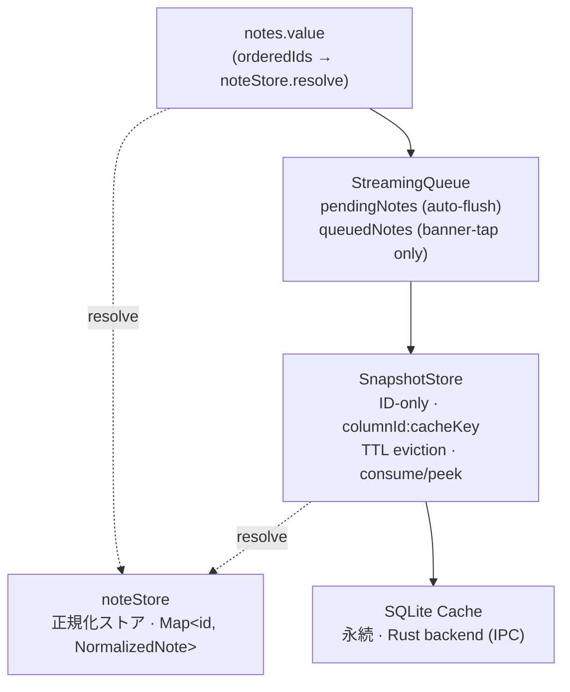

# ARCHITECTURE

NoteDeck — マルチサーバー対応 Misskey デッキクライアントのアーキテクチャ。

---

## 目次

- [アーキテクチャ概要](#アーキテクチャ概要)
  - [全体像](#全体像)
  - [notedeck（GUI アプリ）](#notedeckgui-アプリ)
  - [notecli（コアライブラリ）](#notecliコアライブラリ)
- [ノートキャッシュ・キューアーキテクチャ](#ノートキャッシュキューアーキテクチャ)
- [レンダリングパフォーマンス](#レンダリングパフォーマンス)
- [採用状況マトリクス](#採用状況マトリクス)

---

## アーキテクチャ概要

### 全体像


**技術スタック:**
- **フレームワーク**: Tauri V2
- **フロントエンド**: Vue 3 + TypeScript + Vite（Vapor モード移行予定 [#52](https://github.com/hitalin/notedeck/issues/52)）
- **バックエンド**: Rust (Axum, notecli)
- **対応プラットフォーム**: Windows, macOS, Linux, Android (開発中)

**Frontend ↔ Backend の3つの通信パターン:**



---

### notedeck（GUI アプリ）

#### A-1. Query Bridge（Rust ↔ フロントエンド双方向クエリ）

**場所**: `query_bridge.rs` + `utils/apiBridge.ts`

外部 HTTP リクエスト → Rust → Tauri Event → Vue/Pinia → Tauri Event → Rust → HTTP レスポンス。
フロントエンドのリアクティブ状態（デッキカラム、コマンド一覧等）を外部ツールから直接取得可能。

---

#### A-2. マルチウィンドウ・デッキ（クロスウィンドウ D&D）

**場所**: `useDeckWindow.ts` + `useColumnDrag.ts`

- カラムを別ウィンドウにポップアウト
- ウィンドウ間でカラムをドラッグ移動
- マルチモニター対応のレイアウト保存・復元
- ウィンドウ閉鎖時の自動カラム回収

---

#### A-2b. PiP ウィンドウ（常前面フローティングカラム）

**場所**: `usePipWindow.ts` + `src/views/PipPage.vue`

- デッキのカラムを常前面フローティングウィンドウとして切り離し
- 375×700px（リサイズ可能）、`alwaysOnTop`、複数同時起動（動的ラベル `pip-*`）
- コマンドパレット / タイトルバー / カラムメニューの 3 経路で起動

---

#### A-3. HTTP API（notecli ルーター共有）

**場所**: `http_server.rs`（notedeck）+ `http_server.rs`（notecli）

notecli の `build_core_routes()` でコア API 16ルートを共有し、notedeck 固有ルート（deck, commands, image proxy, OpenAPI docs）を `.merge()` で追加。SSE イベントストリーム、Scalar UI ドキュメント付き。

---

#### A-4. ストリーミング → マルチ配信ブリッジ

**場所**: `streaming.rs` + `EventBus`

WebSocket 受信 → 1箇所で3つの出力先に同時配信:
1. OS ネイティブ通知（`tauri-plugin-notification`）
2. WebView イベント（`app.emit("stream-event")`）
3. SSE（外部 HTTP クライアント向け）

ストリーミングで受信したノートは `db.cache_note()` で SQLite に非同期保存。

---

#### A-5. 3層画像プロキシキャッシュ

**場所**: `image_cache.rs` + `/proxy/image`



CSP で外部画像を直接ロードせず、Rust 側のプロキシを経由。ETag/304 対応、インフライト重複排除、同時フェッチ20件制限。

---

#### A-6. OGP プラグインシステム（15プラットフォーム対応）

**場所**: `ogp/plugins/` (Twitter, YouTube, Pixiv, Amazon, ニコニコ 等)

URL ごとに専用パーサーが起動し、汎用 OG タグ解析より高精度なプレビューを生成。
3段フォールバック: プラグイン → サーバー API → 直接 HTML パース。

---

#### A-7. グローバルショートカット + ボスキー + システムトレイ

**場所**: `lib.rs`（デスクトップ専用 `#[cfg(not(mobile))]`）

- `Ctrl+Shift+B`: ボスキー（瞬時にウィンドウ非表示）
- `Ctrl+Alt+N`: クイックノート（ウィンドウ表示 + 投稿フォーム起動）
- トレイアイコン: 左クリックで表示切替、右クリックメニュー
- 閉じるボタン: トレイに隠す（終了しない）

---

#### A-8. オフラインファースト（読み取り専用）

**場所**: `useNoteColumn.ts` + `useColumnSetup.ts` + `DeckTimelineColumn.vue`



- **オフライン検出**: WebSocket 切断 (`disconnected`/`reconnecting`) + API fetch 失敗の両方で即座に検出
- **キャッシュ自動切替**: API 失敗時にキャッシュ済みノートを表示し続ける。スクロールで古いノートも SQLite から読み込み
- **書き込みガード**: オフライン時はリアクション・リノート・リプライ・引用・削除・編集・ブックマークをサイレントにブロック
- **自動復帰**: WebSocket 再接続成功 or API fetch 成功で `isOffline` が自動解除
- **UI バナー**: 「オフライン — キャッシュを表示中」をカラム上部に表示

**方針**: 書き込みキューイングは行わない。Misskey はリアルタイム性が重要な SNS であり、オフライン時に蓄積した操作を後から送信しても文脈が失われる。

---

#### A-9. フロントエンド層

**Pinia Stores (19個):**

| Store | 役割 |
|-------|------|
| `accounts` | マルチアカウント管理（ゲスト・ログアウト済みアカウント含む） |
| `deck` | デッキ・カラム・レイアウト・プロファイル管理（40+カラム種別） |
| `streaming` | WebSocket接続状態・購読管理 |
| `notes` | ノートのキャッシュ・正規化 |
| `emojis` | カスタム絵文字管理 |
| `servers` | 接続先サーバー情報 |
| `theme` | テーマ設定 |
| `ui` | UI状態 |
| `keybinds` | キーバインド設定 |
| `windows` | マルチウィンドウ管理 |
| `plugins` | AiScriptプラグイン |
| `pinnedReactions` | ピン留めリアクション |
| `recentEmojis` | 最近使った絵文字 |
| `confirm` | 確認ダイアログ管理 |
| `deckProfile` | デッキプロファイル管理 |
| `deckWallpaper` | デッキ壁紙設定 |
| `performance` | パフォーマンス設定 |
| `themeFileSync` | テーマファイル同期 |
| `toast` | トースト通知 |

**Server Adapter パターン** (`types.ts` → `registry.ts` → `misskey/`):
Misskey 本家および Misskey を名乗り続けるフォークに共通インターフェースで対応。

---

#### A-10. タイムライン DOM 管理

**場所**: `NoteScroller.vue` + `useNoteList.ts` + `useStreamingBatch.ts`

`@tanstack/vue-virtual` による仮想スクロールで、viewport + overscan 分のみ DOM に描画する。

**仮想スクロール:**

| 設定 | 値 | 説明 |
|------|-----|------|
| `noteListMax` | 200（デフォルト） | データ配列の上限（`performanceStore` で設定可能、50〜1000） |
| `overscan` | 7 | viewport 外に余分に描画する件数 |
| `estimateSize` | 動的 | 実測値の移動平均（20件ごとに更新） |

- `NoteScroller.vue` が `useVirtualizer` で仮想化。実 DOM は 30-50 件程度に抑制
- `measureElement` + ResizeObserver で可変高さ（テキストのみ 80px〜画像付き 400px+）を自動追跡
- `near-end` イベントで末尾到達を検知し loadMore を発火
- `scrollToIndex` expose でキーボードナビゲーション（j/k）に対応

**アニメーション:**

`<TransitionGroup>` は使わず、データレイヤーでの ID マーキング + CSS `@keyframes` で新着ノートの slide-in アニメーションを実現。位置指定に `translate` プロパティ、アニメーションに `transform` プロパティを使い、独立プロパティとして干渉なく動作する。Vue Vapor Mode 互換。

**バッファリング:**

- `useStreamingBatch` は RAF バッファリング + pending 2段階で高頻度更新を1フレームにまとめる
- 超過分は末尾から削除。削除されたノートは SQLite に保存済みのため再取得可能

---

### notecli（コアライブラリ）

notecli は notedeck のコア基盤となる Rust クレートであり、**スタンドアロン CLI** と **ライブラリ** の二重の役割を持つ。

#### B-1. デュアルパーパス・クレート設計

| モード | エントリポイント | FrontendEmitter | HTTP サーバー |
|--------|------------------|-----------------|---------------|
| **CLI** | `main.rs` (clap) | `NoopEmitter` | なし |
| **デーモン** | `main.rs --daemon` | `EventBusEmitter` | Axum (16ルート) |
| **notedeck 組込** | `lib.rs` (ライブラリ) | `TauriEmitter` (notedeck側) | 拡張版 Axum (notecli の `build_core_routes()` + notedeck 固有ルート) |

同じビジネスロジック（API呼び出し、DB操作、ストリーミング）が CLI・デーモン・GUI のすべてで共有される。

---

#### B-2. FrontendEmitter トレイトパターン

ストリーミング（WebSocket）からのイベント配信を実行環境ごとに分離する Strategy パターン:
- **CLI**: `NoopEmitter`（何もしない）
- **デーモン**: `EventBusEmitter`（broadcast channel → SSE）
- **Tauri GUI**: `TauriEmitter`（Tauri Event System → Vue）

---

#### B-3. Raw → Normalized モデル変換

Misskey API レスポンスはフォークによってフィールドが異なる問題を2層モデルで解決:

- 既知フィールドは型安全にデシリアライズ
- 未知フィールド（フォーク固有）は `extra: HashMap<String, Value>` に自動収集
- `normalize()` で統一的な `NormalizedNote` に変換
- 新フォーク固有フィールド追加時に **コード変更不要**

セキュリティ: `Account` の `Drop` 実装で `token.zeroize()` を呼び、メモリ残留リスクを最小化。

---

#### B-4. SQLite + FTS5 + refinery マイグレーション

**DB マイグレーション**: refinery による番号付き SQL マイグレーション (`migrations/V1__*.sql`)。`refinery_schema_history` テーブルでバージョンを自動追跡。今後のスキーマ変更は SQL ファイル追加のみで対応可能。

**FTS5 トライグラム検索**:
```sql
CREATE VIRTUAL TABLE notes_fts USING fts5(
    text, content=notes_cache, content_rowid=rowid, tokenize='trigram'
);
```
CJK（日本語・中国語・韓国語）の部分文字列検索に対応。CW も検索対象。

---

#### B-5. プラットフォーム・キーチェーン抽象化

条件付きコンパイルで各 OS ネイティブのキーチェーンに対応:
- Android → `AndroidNativeCredentialStore`
- macOS/iOS → `IosKeychain::Authenticated`
- Windows → `WindowsNativeCredentialStore`
- Linux → `LinuxKeyutilsPersistentStore`

クレデンシャル解決: キーチェーン → DB フォールバック → 遅延移行（既存ユーザーの自動移行）。

**ゲスト・ログアウト対応**: `get_credentials_or_anon()` でトークンがなければ `(host, "")` を返し、notecli が公開 API にフォールバック。認証必須 API は従来の `get_credentials()` を使用。

---

#### B-6. ストリーミング・マネージャー

- **指数バックオフ再接続**: 接続断 → 1秒 → 2秒 → ... → 最大30秒。成功時にバックオフリセット + 全サブスクリプション再送信
- **メッセージ処理**: `spawn_blocking` で SQLite 書き込みを非同期タスクからオフロード
- **ノート自動キャッシュ**: ストリーミング受信ノートを SQLite に非同期保存（オフラインファースト基盤）

---

#### B-7. CLI 設計：Unix 哲学の適用

5つの出力フォーマット（Default, JSON, JSONL, IDs, Compact/TSV）でパイプライン処理に対応。

```bash
notecli tl -f compact | fzf | cut -f1 | xargs notecli note
notecli tl -f json | jq '.[].text'
```

---

#### B-8. エラーハンドリング: safe_message() パターン

内部情報（SQLite クエリ、ネットワークトレース、キーチェーン詳細）はフロントエンドに露出させない。`Serialize` 実装で `code` + `safe_message` のペアを自動生成。

---

### Vue Vapor モード移行（[#52](https://github.com/hitalin/notedeck/issues/52)）

Vue 3.6 で導入予定の Vapor モード（仮想DOMレス）への移行を計画中。
コーディング制約（`<script setup>` 必須、`h()`/JSX 禁止等）は全コンポーネントで遵守済み。

**`<Transition>` / `<TransitionGroup>` 完全除去済み。** 全22箇所を composable（`useVaporTransition`, `useVaporTransitionSwitch`, `useVaporTransitionGroup` — すべて `useVaporTransition.ts` からエクスポート）+ CSS `@keyframes` に移行。leave animation は composable で DOM 除去を遅延させることで実現。

**`<Teleport>` も全箇所除去済み。** Vapor 非互換の組み込みコンポーネントは解消済み。

---

## ノートキャッシュ・キューアーキテクチャ

ノートデータは **正規化ストア + ID ベースビュー** で管理する。各カラムはノート実体を持たず、ID の順序リストのみを保持する。



### 正規化ストア（noteStore）

全ノートの唯一の実体を保持するグローバル `Map<string, NormalizedNote>`。

- カラムは `orderedIds`（ID 配列）のみを保持し、`noteStore.resolve(ids)` で実体を取得
- ノート更新は `noteStore.put()` で in-place 反映 → 全カラムに自動伝播
- ノート削除は `noteStore.remove()` → `onDelete` リスナーで全カラムの `orderedIds` をクリーンアップ
- セッション中は eviction なし（表示済みノートは常に保持）

### Layer 1: SQLite Cache

Rust 側（notecli）で管理する永続キャッシュ。フロントエンドは read + delete のみ。

- `loadCachedTimeline(accountId, tlType)` — キャッシュ読み込み
- `loadCachedTimelineBefore(accountId, tlType, before)` — 過去ノート読み込み
- `purgeStaleCachedNotes(adapter, ids, ...)` — サーバーに存在しないノートを削除

書き込みは Rust 側のストリーミング処理が担当。

### Layer 2: SnapshotStore（ID-only）

カラム再マウントやタブ切り替え時の即時復元用。**ID のみ保存**し、復元時に `noteStore.resolve()` で実体を取得する。

- **キー**: `${columnId}:${cacheKey}` の複合キー
  - `cacheKey` は `config.cache.getKey()` が返す値（カラムタイプに応じた文脈キー）
  - Timeline カラム: `"home"`, `"local"`, `"global"` 等
  - Antenna カラム: `"antenna:${antennaId}"`
  - Channel カラム: `"channel:${channelId}"`
  - Favorites/Mentions 等: `"favorites"`, `"mentions"` （固定）
- **内部値**: `{ noteIds: string[], scrollTop: number, savedAt: number }`
- **復元値**: `{ notes: NormalizedNote[], scrollTop: number }`（resolve 済み）
- **eviction**: TTL ベース（`performanceStore.snapshotTTL`）。save 時に expired を一括削除
- **上限**: `performanceStore.snapshotMaxNotes` で保存 ID 数を制限
- **メモリ効率**: NormalizedNote[] を丸ごと保持する設計と比較して約 100 倍削減

| 操作 | 用途 | 消費 |
|------|------|------|
| `save(colId, cacheKey, notes, scrollTop)` | ID + scrollTop を保存 | — |
| `restore(colId, cacheKey)` | タブ切り替え復元 | **非消費**（何度も復元可能） |
| `restoreAndConsume(colId, cacheKey)` | カラム再マウント復元 | **消費**（1回限り） |
| `evictColumn(colId)` | カラム削除時に全 cacheKey 消去 | — |

### Layer 3: StreamingQueue（useStreamingBatch）

ストリーミングで受信したノートのバッファリングとバナー表示を管理。

| キュー | 用途 | auto-flush |
|--------|------|------------|
| `pendingNotes` | スクロール中に溜まったストリーミングノート | **する**（Misskey 本家準拠: スクロールトップで flush） |
| `queuedNotes` | タブ切り替え差分フェッチ結果 | **しない**（バナータップ / `scrollToTop()` のみ） |

`scrollToTop()` 時に `queuedNotes` → `pendingNotes` にマージしてから `flushPending()` を実行。アニメーション処理を統一する。

### ロードパス共通ヘルパー（useNoteColumn）

4 つのデータロードパス（`connect` / `reconnect` / `switchWithSnapshot` / `onResume`）は以下の共通ヘルパーを使用:

- `fetchAndDedup(adapter, opts)` — dedup 付き API フェッチ
- `verifyStaleNotes(adapter, cachedIds, freshIds)` — キャッシュ整合性検証
- `handleFetchError(e, tryCacheFallback?)` — エラーハンドリング（オフラインフォールバック）
- `mergeUpdate(newNotes)` — 既存ノートを in-place 更新 + 新規ノートを挿入（`useNoteList`）

### キー不変条件

1. **正規化ストアが唯一の実体**: ノートの正規データは `noteStore` にのみ存在。カラム・スナップショットは ID 参照のみ
2. **スナップショットは降順**: noteIds は `createdAt` 降順で保存。復元時に再ソートしない
3. **noteIds 整合性**: `setNotes()` 後、`noteIds` は `notes.value` の ID と完全一致（`useNoteList` の setter が保証）
4. **StreamingQueue 分離**: `pendingNotes` は auto-flush、`queuedNotes` は明示 flush。混同しない
5. **SnapshotStore TTL**: 唯一の eviction 手段。LRU/容量制限は不要（カラム数はデッキレイアウトで制約）
6. **SQLite は読み取り専用**: フロントエンドは read + delete のみ

---

## レンダリングパフォーマンス

3つの基盤で描画パフォーマンスを維持する:

1. **CSS レンダリング規約** — Compositor-only アニメーション（transform, opacity のみ）、Layout Thrashing 回避、CSS Containment
2. **Frame Scheduler** — DOM read/write のフェーズ分離による Layout Thrashing 回避（fastdom と同じ考え方）
3. **Adaptive Quality** — Jank 検出に基づく CSS 描画プロパティ（blur, shadow, animation）の自動調整

仮想スクロールは TanStack vue-virtual（NoteScroller）で対応済み。

詳細は **[DEVELOPMENT.md — レンダリングパフォーマンス](DEVELOPMENT.md#レンダリングパフォーマンス)** を参照。

---

## 採用状況マトリクス

| 領域 | 採用済み |
|------|---------|
| Rust↔Frontend通信 | A-1 Query Bridge |
| マルチウィンドウ | A-2 クロスウィンドウ D&D |
| PiP ウィンドウ | A-2b 常前面フローティングカラム |
| 外部API公開 | A-3 HTTP API（notecli ルーター共有） |
| リアルタイム通信 | A-4 マルチ配信ブリッジ |
| キャッシュ | A-5 3層画像 / A-6 OGP / A-8 オフラインファースト |
| DOM管理 | A-10 上限付き積み上げ（デフォルト200件/カラム、設定で可変） |
| レンダリングパフォーマンス | [DEVELOPMENT.md](DEVELOPMENT.md#レンダリングパフォーマンス) に詳細 |
| OS統合 | A-7 トレイ/ショートカット |
| DB管理 | B-4 refinery マイグレーション |
| テスト | notecli 18件 + notedeck 239件 |
