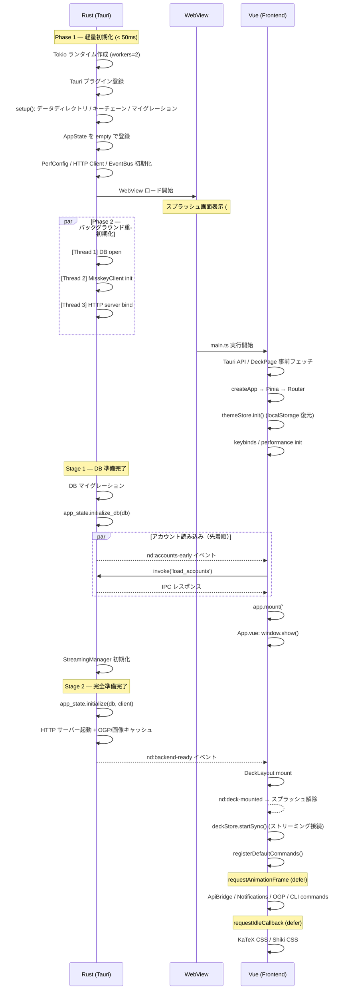
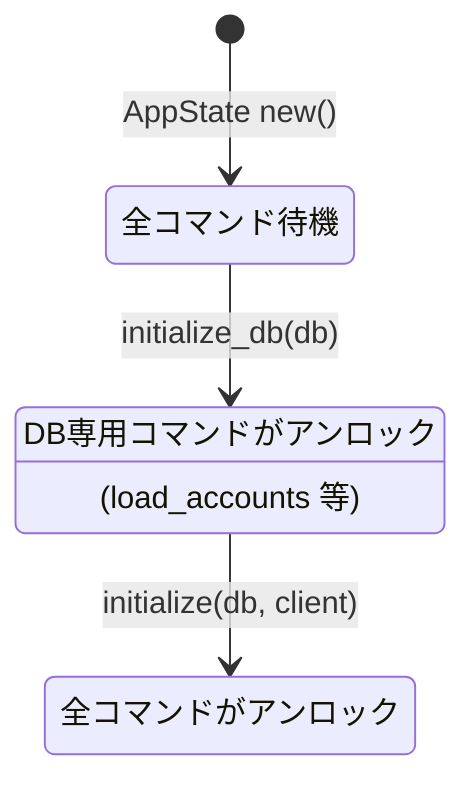
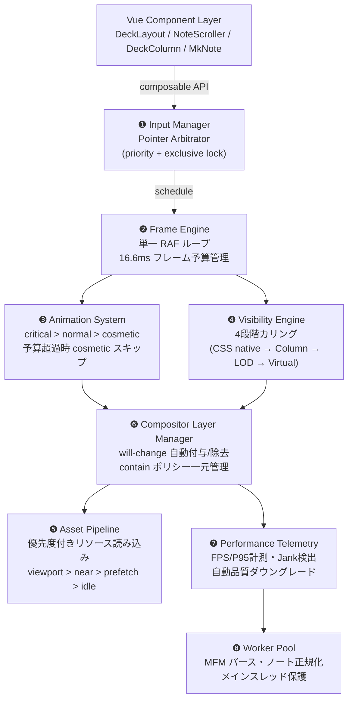
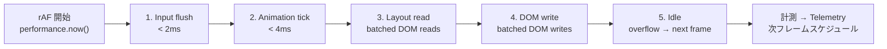
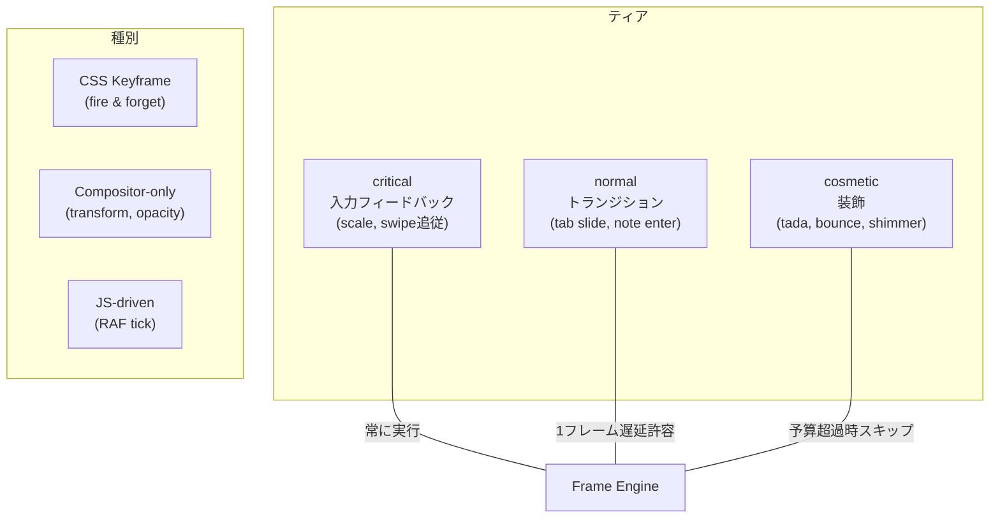
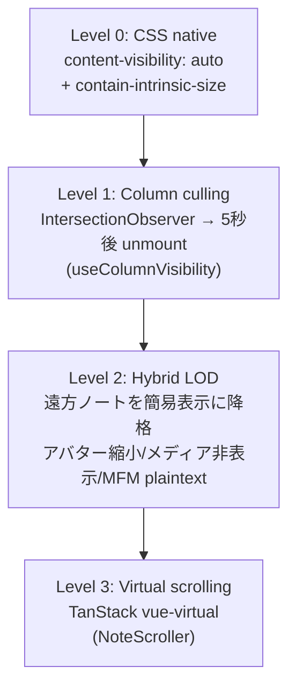
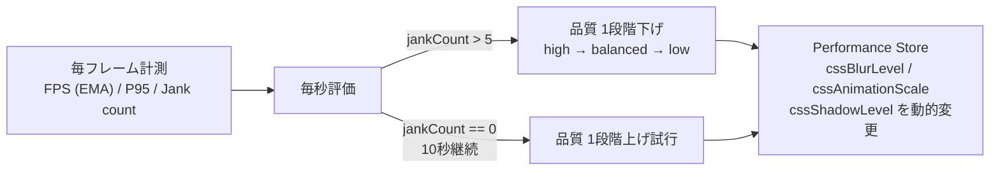

# NoteDeck Development Guide

Multi-server Misskey deck client with fork support. 設計思想・方針は [DESIGN.md](DESIGN.md) を参照。

## Tech Stack

| | |
|---|---|
| Frontend | Vue 3 + TypeScript（Vapor モード移行予定） |
| Backend | Rust (Tauri v2) + [notecli](https://github.com/hitalin/notecli) |
| Build | Vite 8 (Rolldown) + Cargo |
| State | Pinia |
| Local DB | SQLite (rusqlite, WAL mode, FTS5) |
| HTTP | reqwest (Rust, via notecli) |
| WebSocket | tokio-tungstenite (Rust, via notecli) |
| HTTP API | Axum (localhost:19820) |
| Script | AiScript (@syuilo/aiscript) |
| Editor | CodeMirror 6 |
| Linter | Biome |
| Style | SCSS + CSS Modules (`$style`) |
| Test | Vitest + happy-dom |

## Prerequisites

### 推奨: Nix flake（ワンコマンドセットアップ）

[Nix](https://nixos.org/) がインストール済みなら、全ての開発依存が自動で揃います。

```bash
nix develop        # Node.js, pnpm, Rust 等が揃ったシェルに入る
pnpm install       # パッケージインストール
```

[direnv](https://direnv.net/) を使うと `cd` するだけで自動的に環境が有効になります（`.envrc` 同梱）。

### 手動セットアップ

| ツール | インストール |
|--------|-------------|
| [Node.js](https://nodejs.org/) (LTS) | 公式サイト or `nvm install --lts` |
| [pnpm](https://pnpm.io/) | `corepack enable && corepack prepare pnpm@latest --activate` |
| [Rust](https://www.rust-lang.org/) (stable) | `curl --proto '=https' --tlsv1.2 -sSf https://sh.rustup.rs \| sh` |

**Linux のみ**: Tauri のビルドに追加パッケージが必要です。

```bash
# Ubuntu / Debian
sudo apt install libwebkit2gtk-4.1-dev libappindicator3-dev librsvg2-dev patchelf
```

## Getting Started

```bash
# Install dependencies
pnpm install

# Start dev server (Tauri desktop)
pnpm tauri:dev

# Start dev server (browser, for development only)
pnpm dev
```

## Available Scripts

```bash
pnpm dev          # Vite dev server
pnpm tauri:dev    # Tauri dev
pnpm build        # Production build
pnpm tauri:build  # Tauri native build
pnpm test         # Run unit tests
pnpm test:watch   # Run tests in watch mode
pnpm lint         # Lint & format check
pnpm lint:fix     # Lint & format fix
pnpm typecheck    # TypeScript type check
pnpm clean        # Remove build artifacts
```

### テスト構成

テストは 2 プロジェクトに分離（`vitest.config.ts`）:

| プロジェクト | 環境 | ファイルパターン | 用途 |
|------------|------|----------------|------|
| `unit` | Node.js | `*.test.ts` | ロジック・ユーティリティ |
| `dom` | happy-dom | `*.dom.test.ts` | Vue コンポーネント・DOM 操作 |

## Architecture

NoteDeck は **notecli** と **notedeck** の 2 リポジトリで構成されています。

### notecli ([github.com/hitalin/notecli](https://github.com/hitalin/notecli))

Tauri に依存しない Misskey ヘッドレスクライアント。Rust ライブラリ兼 CLI デーモン。

- Misskey HTTP API クライアント、WebSocket ストリーミング、SQLite DB、REST API サーバー
- 単体で `localhost:19820` の HTTP API デーモンとして動作（GUI 不要）
- NoteDeck の Rust バックエンドとして `Cargo.toml` の git 依存で利用される

### notedeck (このリポジトリ)

notecli の上に Tauri v2 + Vue 3 の GUI を載せたクライアント。
対象プラットフォームは Windows / macOS / Linux / Android。

```
src/                        # Vue 3 frontend
├── adapters/               # Server API adapters (Misskey, forks)
│   ├── types.ts            # Shared interfaces (ServerAdapter, ApiAdapter, StreamAdapter)
│   ├── registry.ts         # Adapter factory
│   └── misskey/            # Misskey implementation (IPC via invoke/listen)
├── aiscript/               # AiScript runtime & Misskey Play API
├── commands/               # Command registry, definitions, CLI handlers
├── components/             # Vue components
│   ├── common/             # MkNote, MkPostForm, MkEmoji, CommandPalette, etc.
│   └── deck/               # DeckLayout, DeckColumn, column types
├── composables/            # Vue composables (useNoteFocus, useTimeMachine, etc.)
├── core/                   # Business logic (server detection)
├── data/                   # Static data & constants
├── router/                 # Vue Router definitions
├── stores/                 # Pinia stores (accounts, deck, servers, emojis, theme, etc.)
├── styles/                 # Global CSS (CSS variables)
├── theme/                  # Misskey-compatible theme compiler & applier
├── utils/                  # Shared utilities
└── views/                  # Page components (NoteDetail, UserProfile)

src-tauri/src/              # Rust backend (Tauri 固有部分)
├── lib.rs                  # App setup (tray, plugins, state)
├── commands/               # Tauri IPC command handlers (notecli 呼び出し)
│   ├── mod.rs              # 共通ユーティリティ (validate_host, get_credentials 等)
│   ├── timeline.rs         # タイムライン系コマンド
│   ├── content.rs          # ノート操作系コマンド
│   ├── user.rs             # ユーザー系コマンド
│   ├── messaging.rs        # チャット・DM 系コマンド
│   ├── streaming.rs        # ストリーミング系コマンド
│   ├── settings.rs         # 設定系コマンド
│   ├── admin.rs            # 管理系コマンド
│   ├── auth.rs             # 認証系コマンド
│   ├── enrichment.rs       # OGP・エンリッチメント系コマンド
│   └── utility.rs          # ユーティリティ系コマンド
├── http_server.rs          # Axum HTTP API server (localhost:19820)
├── image_cache.rs          # 3-tier image cache (memory → disk → network)
├── ogp/                    # OGP metadata extraction & cache
├── streaming.rs            # TauriEmitter adapter (FrontendEmitter trait impl)
├── query_bridge.rs         # HTTP API ↔ frontend (Pinia) bridge
├── perf_config.rs          # パフォーマンス設定 (Rust 側)
└── main.rs                 # Entry point
```

Misskey API クライアント・DB・モデル・ストリーミングコアなどの共通ロジックは全て `notecli` クレートにあり、`src-tauri/` には Tauri 固有の薄いラッパーのみ残っています。

### Boot Sequence

NoteDeck は **UI 表示までの時間を最小化** するため、バックエンドの重い初期化をバックグラウンドで行いながらフロントエンドを先行起動する設計になっている。

#### 全体フロー

Rust バックエンドとフロントエンドが並列に動作し、イベントで連携する。



#### Two-stage AppState

バックエンドの初期化を 2 段階に分けて、DB が準備できた時点で一部のコマンドを先行アンロックする仕組み（`src-tauri/src/commands/mod.rs`）。



内部的には `tokio::sync::watch::channel` を 2 本持ち、`db()` は DB チャネルのみ、`client()` はフルチャネルを待機する。これにより `load_accounts` のようなDB専用コマンドは MisskeyClient の初期化を待たずに応答できる。

#### スプラッシュ画面

`index.html` にインラインで定義された `#nd-splash`（ハートビートアニメーション付きロゴ）。

- **表示**: WebView ロード直後（Vue マウント前から表示済み）
- **解除**: `nd:deck-mounted` イベント受信時（DeckLayout の DOM 構築完了時点）
- **フォールバック**: 500ms タイムアウトで強制解除
- **アニメーション**: `opacity: 0` トランジション → `transitionend` で DOM 削除

データ（ノート等）のロード完了は待たず、カラムフレームの描画が完了した時点でスプラッシュを解除する。

#### 起動時の最適化テクニック

| テクニック | 実装箇所 | 効果 |
|-----------|---------|------|
| Two-stage AppState | `commands/mod.rs` | DB 準備次第でアカウント読み込み開始 |
| 早期アカウントイベント | `lib.rs` → `nd:accounts-early` | IPC 往復を待たずにフロントへ通知 |
| 動的 import 事前フェッチ | `main.ts` | DeckPage / カラムチャンクを並列ダウンロード |
| テーマ localStorage 復元 | `themeStore.init()` | ネットワーク不要で FOUC 防止 |
| 3 スレッド並列初期化 | `lib.rs` Phase 2 | DB / Client / HTTP bind を同時実行 |
| 非クリティカル処理の defer | `useDeckInit` | rAF / rIC で初回描画を優先 |

### Multi-Window & Profile Architecture

ウィンドウとプロファイルは**直交する概念**です。

- **プロファイル**: カラム構成・レイアウトの保存単位。データの所有者
- **ウィンドウ**: プロファイルの表示先。同じプロファイルを複数ウィンドウで開ける

```
Profile A ──→ Main Window（windowId なしのカラムを表示）
         └──→ Sub Window 1（windowId = "w1" のカラムを表示）

Profile B ──→ Main Window（プロファイル切り替え時）
```

**設計原則:**

1. プロファイルが変更されたら、そのプロファイルを開いている**全ウィンドウ**がリアクティブに追従する
2. 各ウィンドウは `windowLayout`（computed）で自分に属するカラムだけをフィルタして表示する
3. ウィンドウの作成・破棄はプロファイルのデータに影響しない

**同期方式:** localStorage（全 webview 共有）を SSoT とし、Tauri イベント（`deck:profile-updated`）でキャッシュ無効化を通知。Rust 側に SSoT を移す案も検討したが、localStorage が既に全 webview で共有されており、本質的に同じ構造になるため不採用（[PR #172](https://github.com/hitalin/notedeck/pull/172) で議論）。

### Window / Column Model（[#194](https://github.com/hitalin/notedeck/issues/194)）

ウィンドウとカラムは「ストリーム / 詳細 / ツール」の3分類で役割を分担する。

| 分類 | UI | 用途 | 永続性 |
|------|-----|------|--------|
| **ストリーム** | カラム | 継続的なデータフィード（TL、通知、検索、チャット等） | プロファイルに永続化 |
| **詳細** | ウィンドウ | 特定アイテムの一時的な表示（ノート詳細、プロフィール、フォローリスト） | セッション限り |
| **ツール** | ウィンドウ | アプリ設定・管理（ログイン、エディタ群、プラグイン、about） | セッション限り |

**Cross-account カラム:**

ストリーム系カラムは `accountId` で動作モードが決まる。

- `accountId: "user-xxx"` → **per-account**（`useColumnSetup` で単一アダプタ）
- `accountId: null` → **cross-account**（`useMultiAccountAdapters` で全アカウント並列取得）

対応済みカラム: 通知、検索、チャット、メンション、ダイレクト、フォローリクエスト。

**ナビバー（VSCode Activity Bar 式）:**

左ナビバーのアイコンはカラムの**トグルボタン**として機能する。クリックでサイドバーカラムを左端（`layout[0]`）に挿入、再クリックで削除。同時に1スロットのみ（`sidebar: true` フラグで管理）。

ナビバーのボタン構成はカスタマイズ可能（設定 → ナビバー）。`NavItem = { type, accountId } | { type: 'divider' }` 構造体でプロファイルに永続化される。

**共通コンポーネント:**

| コンポーネント | 用途 | 使用箇所 |
|-------------|------|---------|
| `ColumnBadges` | サーバー/アカウントバッジ表示 | DeckNavbar, DeckBottomBar, DeckMobileNav |
| `AvatarStack` | cross-account 時のアカウントアバター重ね表示 | AddColumnDialog, カラムヘッダー |
| `EditorTabs` | ビジュアル/コード 2タブ切替 | 全エディタ系ウィンドウ共通 |

**共通 composable:**

| composable | 用途 | 使用箇所 |
|-----------|------|---------|
| `usePointerReorder` | Pointer イベントによるドラッグ&ドロップ並び替え（軸指定対応） | NavEditorContent, ProfileEditorContent |
| `useCrossAccountNotes` | 複数アカウントからのノート並列取得・統合・重複排除 | DeckMentionsColumn, DeckSpecifiedColumn |

**アイコン・ラベルの一元定義:**

`useColumnTabs.ts` の `COLUMN_ICONS` / `COLUMN_LABELS` がカラムタイプのアイコンとラベルの SSoT。ナビバー、ボトムバー、エディタすべてがこれを参照する。

### Vue Vapor モード移行準備（[#52](https://github.com/hitalin/notedeck/issues/52)）

Vue 3.6 の Vapor モード（仮想DOMレス・コンパイル時DOM操作）への移行を予定。

**コーディング制約（Vapor 互換性維持）:**

- `<script setup>` 必須 — Options API / `export default {}` 禁止
- `h()` / JSX 禁止 — テンプレート構文のみ使用
- カスタムディレクティブ禁止 — composable で代替
- mixins / extends 禁止 — composable で代替
- `getCurrentInstance()` 禁止 — provide/inject または composable で代替
- `app.config.globalProperties` 禁止 — provide/inject で代替

**`<Transition>` / `<TransitionGroup>` 完全除去済み:**

全22箇所を `useVaporTransition` / `useVaporTransitionSwitch` / `useVaporTransitionGroup` composable（すべて `useVaporTransition.ts` からエクスポート）+ CSS `@keyframes` に移行済み。`<Teleport>` も全箇所除去済みで、Vapor 非互換は解消済み。

### Styling

コンポーネントのスタイリングには **CSS Modules + SCSS** を使用しています。

```vue
<template>
  <div :class="$style.container">...</div>
</template>

<style module lang="scss">
.container {
  display: flex;
}
</style>
```

- `<style module lang="scss">` で CSS Modules として定義し、テンプレートから `$style.xxx` で参照
- `vite.config.ts` で `localsConvention: 'camelCaseOnly'` を設定済み（`kebab-case` → `camelCase` 自動変換）
- グローバルな CSS 変数は `src/styles/global.css` で定義
- モバイル/デスクトップの切り替えは CSS の `display` ではなく `v-if` で制御

### キーボード操作（アクセシビリティ）

すべての UI 操作がキーボードだけで完結できることを目標とする。以下の composable を利用する。

#### `useFocusTrap(containerRef, options?)`

ダイアログ・モーダル・ポップアップで **Tab をコンテナ内にトラップ** + **Esc で閉じる** + **初期フォーカス設定**。

```ts
const dialogRef = ref<HTMLElement | null>(null)
const { activate, deactivate } = useFocusTrap(dialogRef, {
  initialFocus: 'button.primary', // CSSセレクタ（省略時は最初のfocusable要素）
  onEscape: () => close(),
})

// ダイアログ表示時: nextTick(activate)
// ダイアログ非表示時: deactivate()
```

**適用済み**: `AppConfirm`, `AddColumnDialog`, `NoteReactionPickerPopup`

#### `useMenuKeyboard(options)`

メニュー・ポップアップで **Arrow Up/Down ナビ** + **Home/End** + **Enter 選択** + **Esc 閉じ**。

```ts
const menuRef = ref<HTMLElement | null>(null)
const { activate, deactivate } = useMenuKeyboard({
  containerRef: menuRef,
  itemSelector: 'button',  // ナビ対象のCSSセレクタ
  onClose: () => close(),
})
```

**適用済み**: `PopupMenu`（NoteMoreMenu 等の全派生に波及）, `DeckSettingsMenu`, `DeckProfileMenu`, `NavAccountMenu`

#### 新規コンポーネント作成時のルール

- **ダイアログ/モーダル** → `useFocusTrap` を適用（Esc 閉じ + Tab トラップ必須）
- **ポップアップメニュー** → `PopupMenu` を使えば自動対応。手動メニューは `useMenuKeyboard` を適用
- **クリック専用の `<div>`** → `tabindex="0"` + `@keydown.enter` を追加してキーボードから操作可能にする
- **新機能** → コマンドパレット（`src/commands/definitions.ts`）へのコマンド登録を検討

### AI 設定

NoteDeck にはローカル LLM / OpenAI 互換 API を使った AI 機能がある。

| ファイル | 役割 |
|---------|------|
| `src/components/window/AiSettingsContent.vue` | AI 設定ウィンドウ（プロバイダー選択・プロンプト編集） |
| `src/defaults/AI.md` | デフォルトシステムプロンプト（syuilo/ai ベース） |
| `src/utils/settingsFs.ts` | Tauri ファイル I/O（`ai.json` 等の読み書き） |

**永続化:**
- 設定はファイル（`ai.json`）+ localStorage の二層保存
- **API キーはファイルに含めない**（localStorage のみ保存、セキュリティ対策）
- ファイルはバックアップ・エクスポート対象

**対応プロバイダー:** Ollama / OpenAI / カスタム OpenAI 互換エンドポイント

### パフォーマンス設定

NoteDeck のパフォーマンス関連パラメータはすべてユーザーが調整可能。設定エディタ UI とプリセット、ファイルベースのバックアップに対応している。

| ファイル | 役割 |
|---------|------|
| `src/stores/performance.ts` | Pinia ストア（`PerformanceConfig` 型定義・プリセット・Rust 同期） |
| `src/components/window/PerformanceEditorContent.vue` | 設定エディタ UI |
| `src/defaults/performance.json` | デフォルト値（「バランス」プリセット相当） |
| `src/utils/settingsFs.ts` | Tauri ファイル I/O（`performance.json` 読み書き） |

**カテゴリ:** 絵文字キャッシュ / ノート / パースキャッシュ / リアルタイム / バックエンド（Rust）

**プリセット:**

| プリセット | 想定用途 |
|-----------|---------|
| 省メモリ | 低スペック端末・メモリ節約 |
| バランス | デフォルト（`defaults/performance.json` と同値） |
| 高パフォーマンス | ハイエンド端末・大量カラム運用 |

**永続化:**
- 設定はファイル（`performance.json`）+ localStorage の二層保存
- デフォルト値と同じキーはオーバーライドに含めない（差分のみ保存）
- ファイルはバックアップ・エクスポート対象
- バックエンド（Rust）側のパラメータは `invoke('update_performance_config')` で即時同期

### Gaming CSS v2 — レンダリングエンジンアーキテクチャ

ブラウザの GPU コンポジタをレンダリングバックエンド、CSS をシェーダー言語、DOM をシーングラフと見立て、ゲームエンジンのレイヤーを WebView 上に再構成するパフォーマンス基盤。

**[osukey](https://github.com/osukey/osukey) との対比:**

| | osukey (osu-framework / C# / OpenGL) | NoteDeck (Tauri / DOM + CSS) |
|---|---|---|
| **レンダリング** | OpenGL 直描画 | Compositor Layer 昇格 |
| **フレーム管理** | ゲームループ (update → render) | RAF バッチング |
| **ノード再利用** | Draw Node キャッシュ | 仮想スクロール (DOM リサイクル) |
| **テキスト選択・a11y** | 自前実装が必要 | ブラウザネイティブ |

#### CSS レンダリング規約

- **Compositor-only アニメーション**: `transform`, `opacity`, `translate`, `scale`, `rotate` のみ。`width`/`height`/`top`/`left` 等は禁止（全コンポーネント監査済み）
  - タブインジケータ: `left`/`width` → `translate`/`scale`（`useTabIndicator.ts`）
  - 投票バー: `width` → `scaleX` + CSS 変数（`MkPoll.vue`）
  - カラムドラッグ: `style.left`/`top` → `translate` + 幅キャッシュ（`useColumnDrag.ts`）
- **Layout Thrashing 回避**: DOM 読み取り（`offsetHeight` 等）と書き込みを交互に行わない
- **CSS Containment**: スクロール内アイテムに `contain: layout style paint` + `content-visibility: auto`（24+ コンポーネントで適用済み）
- **ペイント誘発プロパティ**: `box-shadow`/`border-radius`/`clip-path`/`backdrop-filter` のアニメーション禁止（静的使用は可）
- **CSS Custom Properties 優先**: JS から直接 `style.top` 等を操作せず `setProperty('--nd-offset', ...)` 経由

#### 全体構成



#### ❶ Input Manager — Pointer Arbitrator

複数ジェスチャー（swipe, pull-refresh, long-press, column-drag）の競合を仲裁する。

```typescript
// src/engine/input/pointerArbitrator.ts
interface GestureCandidate {
  id: string                       // 'swipe-tab' | 'pull-refresh' | ...
  priority: number                 // 高い方が優先
  claim(e: PointerEvent): boolean  // このジェスチャーが対象か判定
  activate(): void                 // ジェスチャー開始
  cancel(): void                   // 他に負けた時
}
```

- pointer 開始時に全候補を試行、`claim()` が true を返した最高優先度が exclusive lock 取得
- DIRECTION_THRESHOLD (8px) 到達時に方向判定 → 軸ロック
- 既存 composable はそのまま維持し、Arbitrator に登録するアダプタを追加

#### ❷ Frame Engine — 統一 RAF ループ

全コンポーネントが個別に `requestAnimationFrame` を呼ぶ代わりに、単一ループでフェーズ別に実行する。



- `isOverBudget` フラグで cosmetic アニメーションを自動スキップ
- 既存 `useFrameScheduler` は Frame Engine の薄いラッパーに変更

#### ❸ Animation System — 優先度付きアニメーション



- 画面外の infinite アニメーションは `animation-play-state: paused` で自動停止（`useAnimationPause`）

#### ❹ Visibility Engine — 4段階カリング



統一 contain ポリシー（`containPolicy.ts`）で `scrollItem`, `popup`, `column` に適切な `contain` を自動適用。

#### ❺ Asset Pipeline — 優先度付きリソース読み込み

| 優先度 | 戦略 |
|--------|------|
| viewport | 即座にフル解像度で読み込み |
| near | `<link rel="preload">` で先読み |
| prefetch | `requestIdleCallback` で低優先度 |
| idle | ネットワーク idle 時のみ |

Progressive Image: `placeholder (blurhash)` → `tiny thumbnail (32px)` → `full image (lazy load)`

#### ❻ Compositor Layer Manager

- アニメーション開始 1 フレーム前に `will-change` 付与、終了後に即除去（GPU メモリ解放）
- Animation System と連携して自動化
- `backdrop-filter` は Adaptive Quality の `cssBlurLevel` で動的 on/off

#### ❼ Performance Telemetry — 継続的監視



開発時のみ DevOverlay（FPS カウンター、フレーム時間グラフ、jank マーカー）を表示。

#### ❽ Worker Pool — メインスレッド保護

| 処理 | 現在 | Worker 化後 |
|------|------|-----------|
| MFM パース | メインスレッド (mfm.js) | Worker で AST 生成 → メインで描画 |
| ノート正規化 | メインスレッド | Worker で変換 → メインで Store 投入 |
| 画像デコード | ブラウザ自動 | `createImageBitmap()` で明示的オフロード |

Worker 非対応環境ではメインスレッドで同期実行にフォールバック。

#### ディレクトリ構成

```
src/engine/
├── index.ts                    # エンジン初期化・エクスポート
├── frameEngine.ts              # ❷ 統一 RAF ループ
├── input/
│   └── pointerArbitrator.ts    # ❶ ジェスチャー仲裁
├── animation/
│   └── animationSystem.ts      # ❸ 優先度付きアニメーション
├── visibility/
│   ├── visibilityEngine.ts     # ❹ 統一カリング
│   └── containPolicy.ts        # contain ユーティリティ
├── assets/
│   └── assetPipeline.ts        # ❺ リソース読み込み
├── compositor/
│   └── layerManager.ts         # ❻ will-change 自動管理
├── telemetry/
│   └── frameTelemetry.ts       # ❼ フレーム監視
└── workers/
    ├── workerPool.ts           # ❽ Worker 管理
    └── mfmWorker.ts            # MFM パース Worker
```

#### 既存 Composable の再配置

| 既存 | v2 での位置 | 変更内容 |
|------|------------|---------|
| `useFrameScheduler` | ❷ Frame Engine のラッパー | phase マッピング追加 |
| `useAdaptiveQuality` | ❼ Telemetry に統合 | 初期検出 + 継続監視 |
| `useStreamingBatch` | そのまま | Frame Engine の write phase 利用 |
| `useVaporTransition` | ❸ Animation System 連携 | tier 指定追加 |
| `useInstantPress` | ❶ Input Manager 登録 | Arbitrator 対応 |
| `useSwipeTab` | ❶ Input Manager 登録 | Arbitrator 対応 |
| `usePullToRefresh` | ❶ Input Manager 登録 | Arbitrator 対応 |
| `useLongPress` | ❶ Input Manager 登録 | Arbitrator 対応 |
| `useColumnDrag` | ❶ Input Manager 登録 | Arbitrator 対応 |
| `useColumnVisibility` | ❹ Visibility Engine L1 | そのまま（ラップ） |
| `useTabIndicator` | ❷ Frame Engine read+write | phase 分離 |
| `useTabSlide` | ❸ Animation System | tier: normal |
| `useImagePrefetch` | ❺ Asset Pipeline 統合 | priority queue 化 |
| `performance.ts` | ❼ Telemetry と双方向連携 | 自動調整受信 |

#### 段階的移行計画

```mermaid
gantt
    title Gaming CSS v2 移行フェーズ
    dateFormat X
    axisFormat %s

    section Phase 1
    Frame Engine + Telemetry        :active, p1, 0, 1
    section Phase 2
    Animation + Visibility          :p2, 1, 2
    section Phase 3
    Input Manager                   :p3, 2, 3
    section Phase 4
    Asset Pipeline + Workers        :p4, 3, 4
```



**Phase 1 — Foundation（Frame Engine + Telemetry）** 🔧 実装中: 統一 RAF ループと計測基盤を構築。既存 `useFrameScheduler` をラッパー化。DevOverlay で FPS/フレーム時間を可視化。

実装済み:
- `src/engine/frameEngine.ts` — 5フェーズ RAF ループ、フレーム予算管理、Jank 検出、cosmetic スキップ
- `src/engine/telemetry/frameTelemetry.ts` — P95 計測、自動品質調整（low/balanced/high）、Vue reactive refs

未実装:
- `src/engine/index.ts` — エンジン初期化・エクスポート
- `src/components/dev/DevFrameOverlay.vue` — 開発用オーバーレイ
- `useFrameScheduler` → Frame Engine ラッパー化
- `useStreamingBatch` / `useTabIndicator` → Frame Engine 利用

**Phase 2 — Animation + Visibility**: アニメーション優先度管理と画面外最適化。`useAnimationPause` で infinite アニメーション自動停止。LOD slot を NoteScroller に追加。

**Phase 3 — Input Manager**: ポインタ入力の一元管理。Pointer Arbitrator で swipe / pull-refresh / long-press の競合を解決。

**Phase 4 — Asset Pipeline + Workers**: MFM パースを Worker にオフロード。画像読み込みを優先度キューで管理。メインスレッドのフレーム予算を保護。

各 Phase で `pnpm test` / `pnpm typecheck` / `pnpm lint` の全パス + ブラウザ動作確認を実施。

### Build

Vite 8 (Rolldown + OXC ベース) を使用。`vite.config.ts` で以下のカスタムプラグインを定義：

- **stripUnusedFonts** — 未使用フォント形式（woff, ttf）をビルドから除外
- **subsetTablerIcons** — ソースコードから使用中のアイコンを検出し、CSS ルールとフォントをサブセット化

### Guest Mode & Logout Fallback

NoteDeck はトークンを持たないユーザーでも公開タイムラインを閲覧できます。

#### ゲストモードとログアウト済みアカウント

| | ゲスト | ログアウト済み |
|---|---|---|
| **userId** | `__guest__`（固定値） | 正規のユーザー ID |
| **hasToken** | `false` | `false` |
| **カラム・設定** | 一時的 | 保持される |
| **UI** | 操作ボタンをグレーアウト | 赤い「ログアウト中」バナー + 再ログイン促進 |

#### Rust バックエンド（`src-tauri/src/commands/`）

- **`get_credentials_or_anon()`** — トークンがあればそのまま、なければ `(host, "")` を返す。notecli が空トークンを検知して公開 API を呼び出す
- **`create_guest_account()`** — `userId = "__guest__"`, `token = ""` のアカウントを DB に作成
- **`logout_account()`** — トークンのみ削除し、アカウント記録と設定は保持

公開 API 対応のコマンドは `get_credentials_or_anon()` を使用し、認証必須のコマンド（投稿・リアクションなど）は従来通り `get_credentials()` を使用します。

#### フロントエンド

| ファイル | 役割 |
|---------|------|
| `src/stores/accounts.ts` | `GUEST_USER_ID`, `isGuestAccount()` |
| `src/composables/useAccountMode.ts` | `isGuest`, `canInteract` computed |
| `src/utils/loginPrompt.ts` | `showLoginPrompt()` — ログイン促進トースト |

ゲスト / ログアウト時の操作ボタン（リアクション・リプライ・リノート）は disabled になり、クリックすると `showLoginPrompt()` でログイン促進トーストを表示します。

#### 新しい API コマンドを追加するとき

- **公開 API**（認証不要）→ `get_credentials_or_anon()` を使う
- **認証必須 API** → `get_credentials()` を使う

### Adding support for a new fork

NoteDeck は adapter パターンでフォークごとの差異を吸収しています。
ほとんどの Misskey フォークは基本アダプターのままで動作しますが、固有機能を活かすには以下の手順で対応を追加できます。

#### 最小構成（Misskey 互換フォーク）

フォークが Misskey API と完全互換なら、検出ロジックとレジストリの追加だけで済みます。

**1. サーバー検出に追加** — `src/core/server.ts`

```typescript
// detectSoftware() 内に追加
if (n === 'yourfork') return 'yourfork'
```

**2. 型定義に追加** — `src/adapters/types.ts`

```typescript
export type ServerSoftware =
  | 'misskey'
  | 'yourfork'  // 追加
  | ...
```

**3. レジストリに登録** — `src/adapters/registry.ts`

```typescript
// Misskey アダプターをそのまま再利用
registerAdapter('yourfork', createMisskeyAdapter)
```

#### 固有機能がある場合

フォーク固有の API やフィルターがある場合は、差分だけをオーバーライドします。

**フィルターの追加** — `src/adapters/types.ts`

```typescript
export const FORK_EXTRA_FILTERS: Partial<
  Record<ServerSoftware, (keyof TimelineFilter)[]>
> = {
  yourfork: ['withBots', 'withSensitive'],
}
```

**API アダプターのオーバーライド** — `src/adapters/yourfork/index.ts`

Misskey アダプターを継承し、差分のみ実装します。
API の実処理は Rust 側（notecli）にあるため、TypeScript 側は薄いブリッジです。

#### チェックリスト

- [ ] `src/core/server.ts` — `detectSoftware()` に追加
- [ ] `src/adapters/types.ts` — `ServerSoftware` に追加
- [ ] `src/adapters/types.ts` — `FORK_EXTRA_FILTERS` に追加（必要なら）
- [ ] `src/adapters/registry.ts` — `registerAdapter()` で登録
- [ ] `src/adapters/<fork>/` — 差分があればアダプター作成

## License

[AGPL-3.0](LICENSE)
